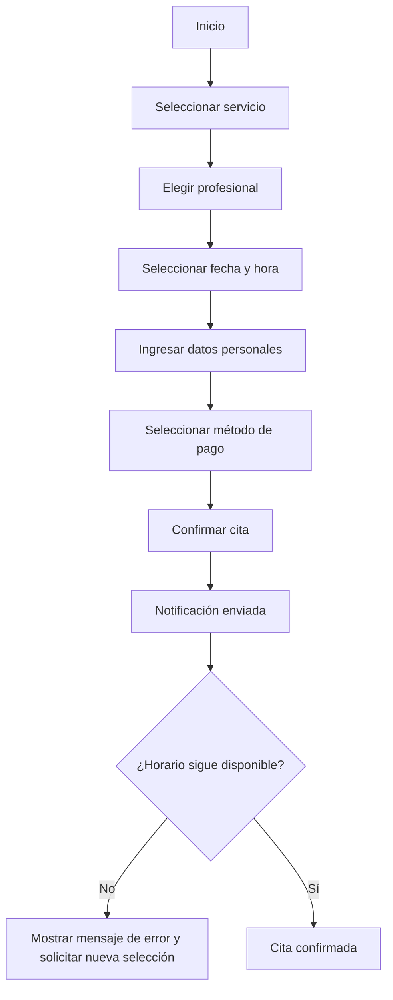
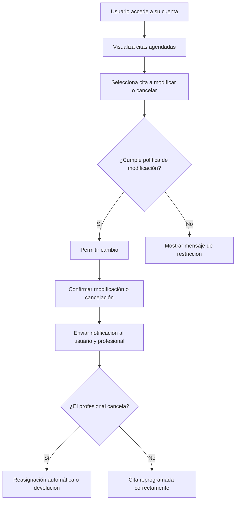

# **Documento Final: Sistema de Agendamiento de Citas**

## **1. Introducción y Objetivo del Documento**

### **Propósito**

Este documento establece las bases para el desarrollo del sistema de **gestión y control de agendamiento de citas**, proporcionando una visión detallada de los requerimientos, flujos de usuario y consideraciones clave.

Servirá como insumo para el equipo de producto, quienes serán responsables de la documentación oficial y la planificación del proyecto.

### **Alcance**

Este sistema de agendamiento será desarrollado como una solución **marca blanca**, permitiendo su personalización para distintos negocios. Para el MVP, la funcionalidad se enfocará en servicios de **psicología y áreas relacionadas**, con la posibilidad de expansión a otros sectores en futuras fases del proyecto.

### **Metodología de Documentación**

El documento sigue un enfoque basado en **mejores prácticas de análisis de negocios**, asegurando que cada sección sea clara, estructurada y fácilmente interpretable por el equipo de producto.

---

## **2. Resumen del Sistema de Agendamiento de Citas**

El sistema de agendamiento de citas permitirá a los usuarios programar, modificar y cancelar citas con profesionales de diferentes sectores.

### **Público Objetivo**

- **Pacientes/Clientes:** Usuarios que requieren reservar sesiones con profesionales.
- **Profesionales:** Psicólogos u otros especialistas que brindan servicios y requieren administrar su disponibilidad.
- **Administradores:** Personal encargado de gestionar la plataforma, validar citas y configurar reglas.

### **Roles de Usuario y Permisos**

| Rol           | Descripción                         | Permisos                                         |
| ------------- | ----------------------------------- | ------------------------------------------------ |
| Paciente      | Usuario que agenda citas            | Crear, modificar y cancelar citas                |
| Profesional   | Especialista que ofrece servicios   | Gestionar disponibilidad, ver citas programadas  |
| Administrador | Gestión y configuración del sistema | Control total, acceso a reportes y configuración |

### **Características Generales**

- Agendamiento de citas en línea con disponibilidad en tiempo real.
- Opciones de pago en efectivo y pasarela de pago online.
- Notificaciones y recordatorios automáticos vía correo y WhatsApp.
- Configuración de disponibilidad y bloqueos de agenda para profesionales.
- Manejo de cancelaciones y modificaciones con reglas personalizables.

---

## **3. Requerimientos Funcionales y No Funcionales**

### **3.1 Requerimientos Funcionales**

| ID    | Requerimiento                       | Descripción                                                      | Prioridad |
| ----- | ----------------------------------- | ---------------------------------------------------------------- | --------- |
| RF-01 | Creación de citas                   | Los usuarios pueden agendar citas con profesionales disponibles. | Alta      |
| RF-02 | Modificación y cancelación de citas | Permitir cambios dentro de los parámetros establecidos.          | Alta      |
| RF-03 | Gestión de disponibilidad           | Los profesionales pueden configurar sus horarios y bloqueos.     | Alta      |
| RF-04 | Notificaciones automáticas          | Confirmaciones y recordatorios por correo y WhatsApp.            | Media     |
| RF-05 | Integración de pagos                | Opción de pago en efectivo y online mediante pasarelas de pago.  | Media     |
| RF-06 | Historial de citas                  | Permitir a los profesionales visualizar citas pasadas y futuras. | Baja      |

### **3.2 Requerimientos No Funcionales**

| ID    | Requerimiento                  | Descripción |
| ----- | ------------------------------ | -------------------------------------------------------------- |
| RNF-01 | Seguridad de datos             | Cumplimiento con normativas de privacidad como RGPD. |
| RNF-02 | Interfaz intuitiva             | Diseño simple y fácil de usar para todos los usuarios. |
| RNF-03 | Escalabilidad                  | Debe permitir la incorporación de más servicios en el futuro. |
| RNF-04 | Alta disponibilidad            | La plataforma debe estar operativa al menos el 99.9% del tiempo. |
| RNF-05 | Integración con terceros       | Capacidad de conectar con calendarios y herramientas externas. |

---

## **4. Flujo de Usuario y Procesos Clave**

### **4.1 Flujo de Agendamiento**

### **4.2 Modificación y Cancelación de Citas**

---

## **6. Referencia a Soluciones Similares**

### **Plataformas de Referencia**

| Plataforma | Características Clave                                         | Diferenciador                                | Limitaciones                                   |
| ---------- | ------------------------------------------------------------- | -------------------------------------------- | ---------------------------------------------- |
| Calendly   | Integración con calendarios, recordatorios, opciones de pago. | Enfoque en profesionales individuales.       | No permite gestión avanzada de disponibilidad. |
| Setmore    | Programación en línea con clientes, pagos y recordatorios.    | Integración con redes sociales.              | No enfocado en profesionales de la salud.      |
| Happoin    | Solución para psicólogos con manejo de citas y pagos.         | Enfoque en profesionales de la salud mental. | Interfaz menos flexible para personalización.  |

---

## **7. Posibles Áreas de Mejora y Diferenciación**

### **Priorización de Innovaciones**

| Innovación                         | Corto Plazo | Mediano Plazo | Largo Plazo |
| ---------------------------------- | ----------- | ------------- | ----------- |
| Personalización profunda           | ✅           | ✅             | ✅           |
| Gestión avanzada de disponibilidad | ✅           | ✅             | ✅           |
| Modelo híbrido de pago             | ❌           | ✅             | ✅           |

---

## **8. Conclusión y Próximos Pasos**

### **Próximos Pasos**

1. Validación final del documento con el equipo de producto.
2. Creación de wireframes del sistema para visualizar el flujo de usuario.
3. Definición de tecnologías y herramientas para el desarrollo del MVP.
4. Inicio de la documentación formal para la planificación y ejecución del proyecto.

