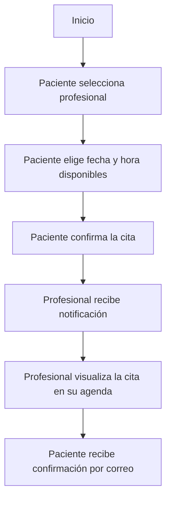
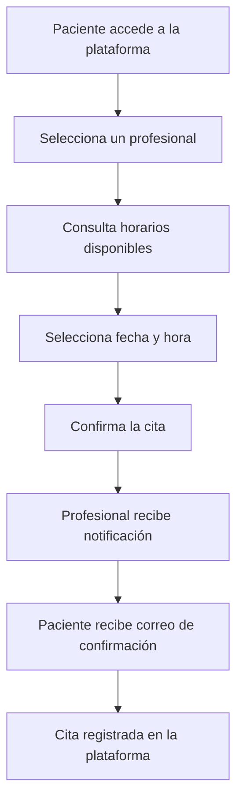
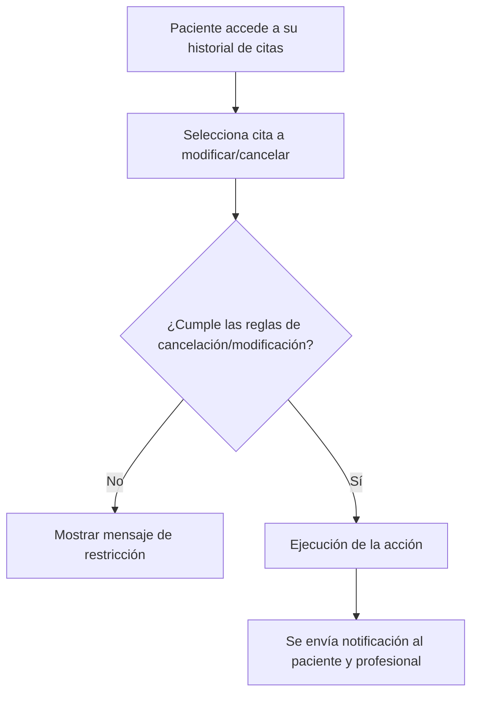

## **1. Introducción**  

### **1.1 Propósito del Documento**  
Este documento define los requerimientos del **MVP del Sistema de Agendamiento de Citas**, estableciendo sus funcionalidades, flujos de usuario y aspectos técnicos clave para su desarrollo.  

El propósito del MVP es entregar una **versión funcional** del sistema en el menor tiempo posible, garantizando su estabilidad y usabilidad.  

### **1.2 Alcance del MVP**  
El **MVP** permitirá a los **pacientes** agendar citas con **profesionales** de psicología y áreas relacionadas, gestionando su disponibilidad de manera manual.  

✅ **Funciones incluidas:**  
- Creación, modificación y cancelación de citas.  
- Gestión de disponibilidad manual por parte de los profesionales.  
- Notificaciones por correo electrónico.  

❌ **Funciones excluidas:**  
- Login y registro de usuarios.  
- Integración con calendarios externos.  
- Personalización avanzada.  
- Pasarela de pago.  
- Reportes y métricas.  

### **1.3 Objetivo del MVP**  
El objetivo del MVP es lanzar una versión operativa del sistema que permita:  
1. Facilitar la programación de citas entre pacientes y profesionales.  
2. Optimizar la gestión de disponibilidad de los profesionales.  
3. Validar la aceptación del sistema con usuarios reales antes de futuras iteraciones.  

---

## **2. Descripción General del Sistema**  

### **2.1 Usuarios y Roles**  

El MVP del sistema de agendamiento de citas cuenta con dos tipos de usuarios:  

| **Rol**       | **Descripción** |
|--------------|--------------------------------------------|
| **Paciente** | Usuario que programa citas con un profesional. Puede modificar y cancelar citas dentro de los parámetros definidos. |
| **Profesional** | Especialista que ofrece servicios. Puede gestionar su disponibilidad y visualizar citas programadas. |

### **2.2 Flujo General de Uso**  

El sistema permite a los pacientes agendar citas con profesionales de acuerdo con su disponibilidad. Los profesionales, a su vez, pueden gestionar su agenda de forma manual.  

El flujo de interacción general entre pacientes y profesionales se describe en el siguiente diagrama:  

### **2.3 Manejo de Pagos**  

El MVP no incluye integración con pasarelas de pago. Todas las transacciones se realizarán **en efectivo en el momento de la cita**, sin intervención del sistema.  

---

## **3. Requerimientos del Producto**  

### **3.1 Requerimientos Funcionales**  

| **ID**  | **Requerimiento**             | **Descripción** |
|--------|-----------------------------|-----------------------------------------------|
| RF-01  | Creación de citas           | Los pacientes pueden agendar citas con profesionales disponibles en la plataforma. |
| RF-02  | Modificación y cancelación  | Los pacientes pueden modificar o cancelar sus citas según las reglas definidas. |
| RF-03  | Gestión de disponibilidad   | Los profesionales pueden definir y actualizar manualmente su disponibilidad. |
| RF-04  | Notificaciones por correo   | El sistema enviará confirmaciones y recordatorios automáticos a los pacientes. |

### **3.2 Requerimientos No Funcionales**  

| **ID**  | **Requerimiento**           | **Descripción** |
|--------|-----------------------------|-------------------------------------------------|
| RNF-01 | Seguridad y privacidad      | El sistema garantizará la protección de datos de los usuarios. |
| RNF-02 | Accesibilidad               | Cumplimiento con los estándares **WCAG** para accesibilidad web. |
| RNF-03 | Disponibilidad              | El sistema deberá estar operativo al menos el **99% del tiempo**. |
| RNF-04 | Escalabilidad básica        | El sistema deberá estar preparado para futuras expansiones sin impacto mayor en la arquitectura actual. |

---

## **4. Flujo de Usuario y Casos de Uso**  

### **4.1 Flujo de Agendamiento de Citas**  

El proceso de agendamiento de citas sigue los siguientes pasos:  

1. El paciente accede a la plataforma.  
2. Selecciona un profesional disponible.  
3. Consulta los horarios habilitados y elige una fecha y hora.  
4. Confirma la cita.  
5. El profesional recibe una notificación de la nueva cita en su agenda.  
6. El paciente recibe un correo de confirmación.  
7. La cita queda registrada en la plataforma.  

📌 **Diagrama del flujo de agendamiento:**  

---

### **4.2 Flujo de Modificación y Cancelación**  

El paciente puede modificar o cancelar su cita según las reglas establecidas.  

#### **Proceso de modificación/cancelación:**  
1. El paciente accede a su historial de citas.  
2. Selecciona la cita que desea modificar o cancelar.  
3. Si la política de cancelación/modificación lo permite, se ejecuta la acción.  
4. Se envía una notificación al paciente y al profesional con la actualización.  

📌 **Diagrama del flujo de modificación/cancelación:**  

---

## **5. Aspectos Técnicos**  

### **5.1 Tecnologías Utilizadas**  

El desarrollo del MVP utilizará las siguientes tecnologías:  

| **Componente** | **Tecnología** |
|--------------|----------------|
| **Backend**  | NestJS |
| **Frontend** | NextJS |
| **Base de Datos** | PostgreSQL |

Estas tecnologías han sido seleccionadas por su capacidad de escalabilidad, rendimiento y compatibilidad con futuras expansiones del sistema.  

---

### **5.2 Infraestructura**  

- **Hospedaje:** El sistema estará alojado en servidores con **alta disponibilidad**, garantizando una operación continua.  
- **Gestión de Base de Datos:** Se empleará **PostgreSQL** como motor de base de datos, asegurando estabilidad y capacidad de crecimiento.  
- **Escalabilidad:** La arquitectura permitirá futuras integraciones y expansión del sistema sin impacto crítico en el rendimiento del MVP.  

---

### **5.3 Integraciones**  

📌 **Exclusiones:**  
El MVP **no** incluirá integración con calendarios externos ni pasarelas de pago.  

📌 **Notificaciones:**  
El sistema **sí integrará** un servicio de correo electrónico para notificaciones automáticas de confirmación y recordatorio de citas.  

---

## **6. Criterios de Aceptación y Validación**  

### **6.1 Definición de Éxito del MVP**  

El MVP se considerará exitoso si cumple con los siguientes criterios:  

✅ **Agendamiento de citas funcional:**  
- Los pacientes pueden agendar citas con profesionales disponibles.  
- La disponibilidad de los profesionales se actualiza correctamente tras una reserva.  

✅ **Gestión de disponibilidad funcional:**  
- Los profesionales pueden establecer y modificar su disponibilidad manualmente.  

✅ **Notificaciones por correo operativas:**  
- Se envían correos electrónicos de confirmación y recordatorios a los pacientes.  
- Los profesionales reciben notificaciones de citas agendadas o modificadas.  

✅ **Interfaz accesible y fácil de usar:**  
- La plataforma cumple con los estándares **WCAG** de accesibilidad.  
- Se realizan pruebas de usabilidad para validar la experiencia del usuario.  

✅ **Estabilidad del sistema:**  
- El sistema mantiene una **disponibilidad mínima del 99%** en el entorno de producción.  
- No presenta errores críticos que impidan el uso normal de sus funciones.  

---

### **6.2 Pruebas y Validación Previas al Lanzamiento**  

Antes del lanzamiento del MVP, se realizarán las siguientes validaciones:  

📌 **Pruebas de Usabilidad:**  
- Se realizarán pruebas con usuarios finales para garantizar que el flujo de agendamiento sea intuitivo.  

📌 **Pruebas de Integración:**  
- Se verificará el correcto funcionamiento de las notificaciones por correo.  

📌 **Pruebas de Carga Básica:**  
- Se evaluará el rendimiento del sistema bajo carga normal de uso, asegurando estabilidad.  

📌 **Revisión de Accesibilidad:**  
- Se validará que la interfaz cumpla con las pautas de accesibilidad **WCAG**.  

---

### **Redacción Iterativa del PRD - Sección 7: Próximos Pasos**  

## **7. Próximos Pasos**  

### **7.1 Fases de Desarrollo e Implementación**  

El desarrollo del MVP seguirá un enfoque iterativo, con las siguientes fases:  

📌 **Fase 1: Diseño y Preparación del Entorno**  
- Creación de la arquitectura del sistema.  
- Configuración del entorno de desarrollo.  
- Definición de los flujos de usuario en wireframes.  

📌 **Fase 2: Desarrollo del MVP**  
- Implementación del módulo de **gestión de disponibilidad**.  
- Desarrollo del flujo de **agendamiento de citas**.  
- Implementación del sistema de **notificaciones por correo**.  

📌 **Fase 3: Pruebas y Validación**  
- Pruebas unitarias y de integración.  
- Pruebas de usabilidad con usuarios reales.  
- Validación de accesibilidad y rendimiento.  

📌 **Fase 4: Lanzamiento y Evaluación**  
- Despliegue en entorno de producción.  
- Monitoreo del rendimiento y estabilidad del sistema.  
- Recopilación de retroalimentación para futuras iteraciones.  

---

### **7.2 Revisión y Mejoras Posteriores**  

Tras el lanzamiento del MVP, se evaluarán los resultados para planificar mejoras en una siguiente versión.  

📌 **Áreas de mejora previstas:**  
- Posible integración con pasarelas de pago.  
- Expansión de reportes y métricas de uso.  
- Optimización del sistema de notificaciones (WhatsApp u otros canales).  

---
