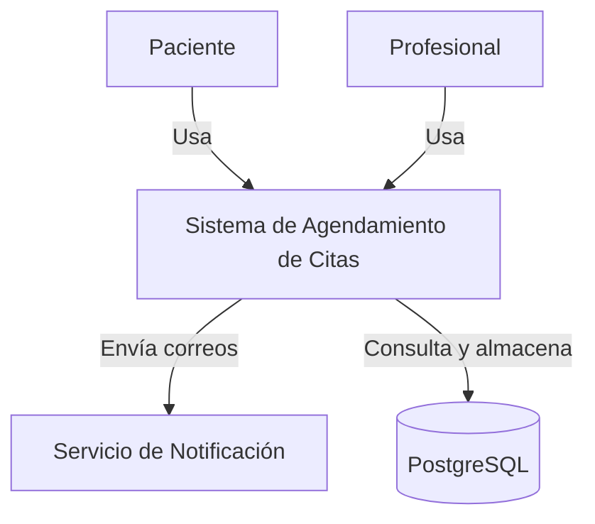
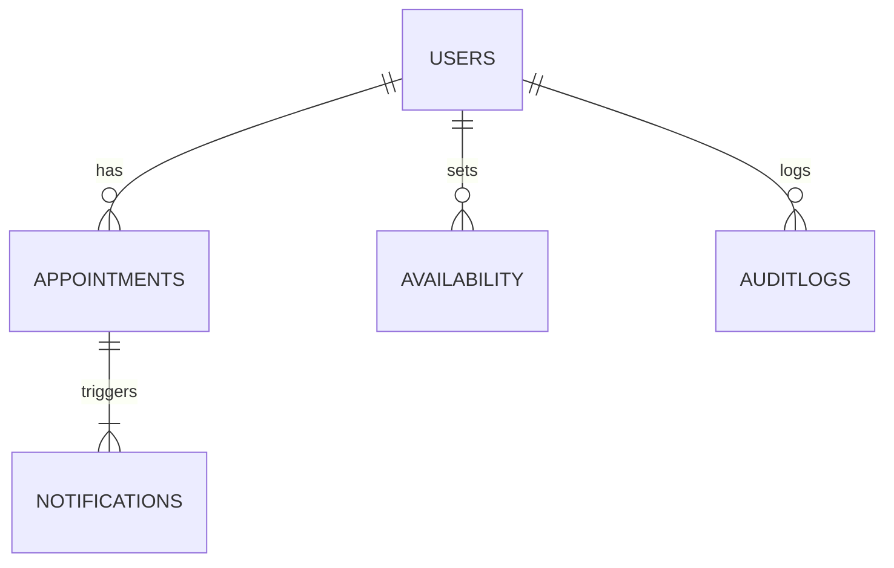
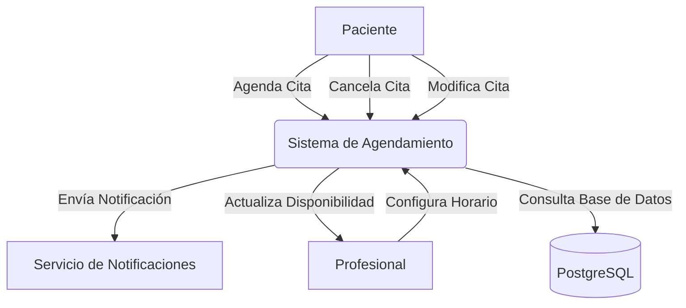
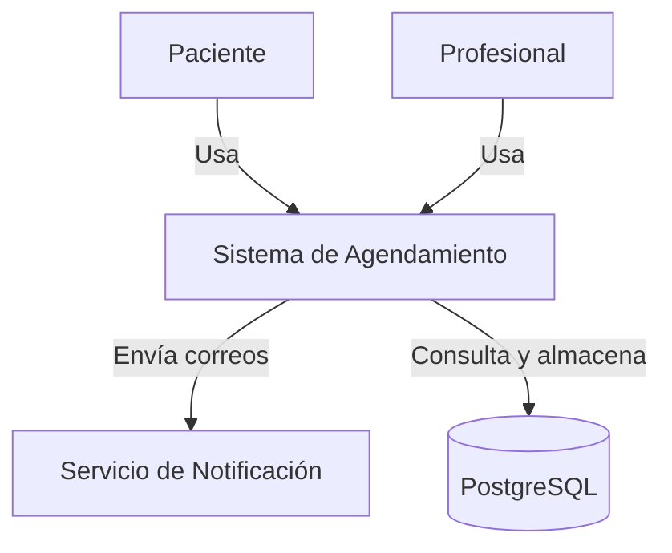
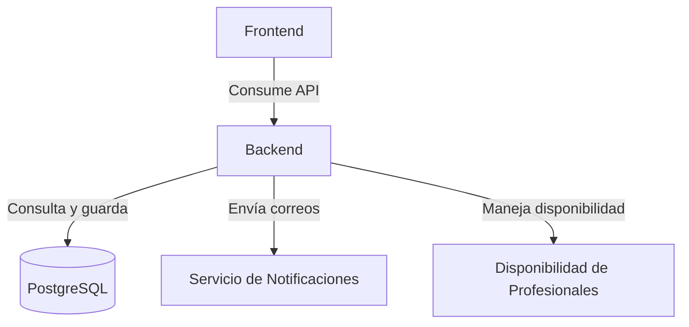
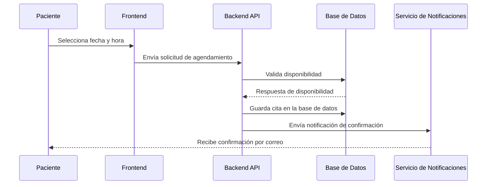
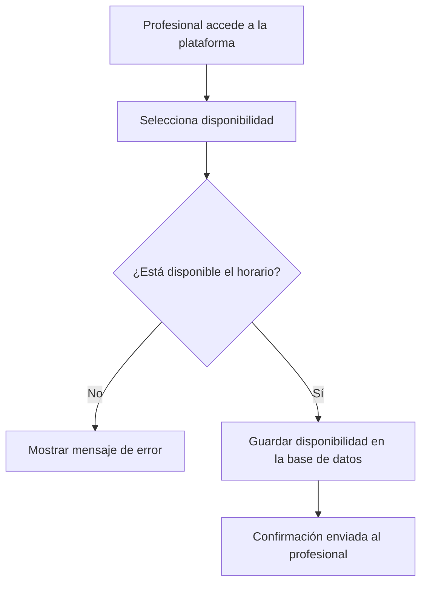
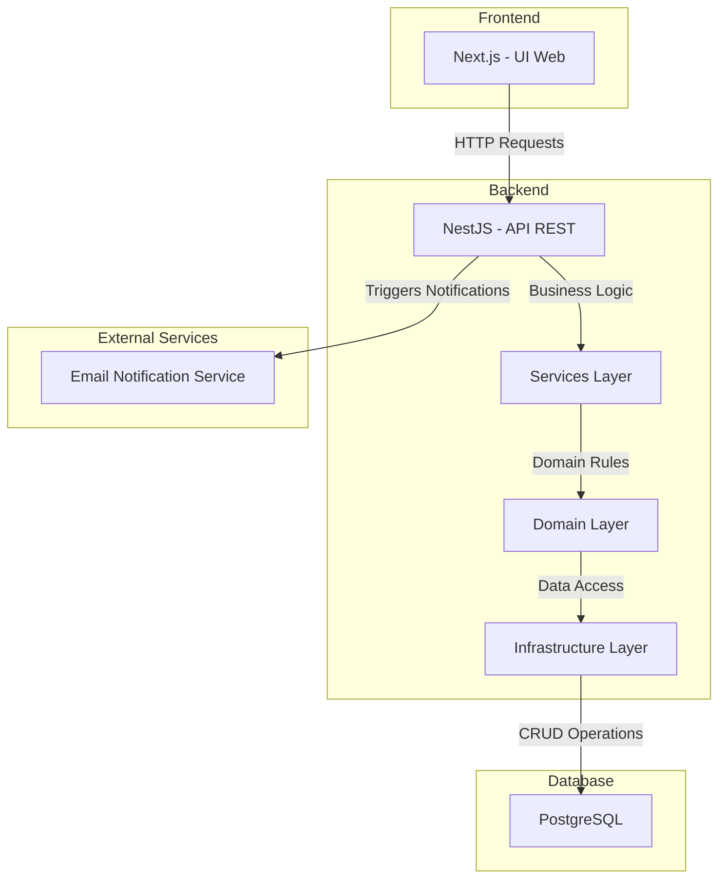

# **Architecture Requirements Document (ARD)**

## **1. Introducción**

### **1.1 Propósito del Documento**  
El propósito de este **Architecture Requirements Document (ARD)** es proporcionar una descripción detallada de la arquitectura del **MVP del Sistema de Agendamiento de Citas**. Este documento servirá como referencia para el equipo de desarrollo, asegurando que el diseño y la implementación del sistema sigan una estructura sólida, escalable y alineada con los objetivos del negocio.  

### **1.2 Alcance de la Arquitectura**  
El alcance de este documento está limitado a la **arquitectura del MVP**, considerando los siguientes aspectos:  
- Implementación de una plataforma de **agendamiento de citas** entre pacientes y profesionales.  
- Gestión de disponibilidad **manual** por parte de los profesionales.  
- Notificaciones por **correo electrónico** para confirmaciones y recordatorios de citas.  
- Uso de tecnologías seleccionadas:  
  - **Backend:** NestJS  
  - **Frontend:** NextJS  
  - **Base de Datos:** PostgreSQL  
- Despliegue en un entorno de **alta disponibilidad** con enfoque en escalabilidad básica.  

**Exclusiones del Alcance:**  
- No se abordará la integración con **pasarelas de pago** ni con **calendarios externos**.  
- No se incluirán funcionalidades avanzadas como **reportes y métricas**.  
- No se implementará un sistema de autenticación de usuarios en esta fase.  

### **1.3 Objetivos y Consideraciones Claves**  
Los objetivos de la arquitectura del MVP incluyen:  
✅ **Simplicidad y rapidez en la implementación:** Diseñar un sistema ligero y funcional en el menor tiempo posible.  
✅ **Escalabilidad futura:** Aunque es un MVP, la arquitectura debe permitir futuras mejoras sin cambios disruptivos.  
✅ **Alta disponibilidad:** Garantizar un **99% de tiempo operativo**, asegurando confiabilidad en la gestión de citas.  
✅ **Seguridad de los datos:** Cumplir con las mejores prácticas en protección de información personal y privacidad.  
✅ **Facilidad de uso:** Asegurar que la experiencia de usuario sea intuitiva y accesible, cumpliendo con estándares **WCAG**.  

---


## **2. Arquitectura General**  

### **2.1 Visión General del Sistema**  
El sistema de agendamiento de citas es una aplicación **web** diseñada para facilitar la gestión de citas entre **pacientes y profesionales**. La arquitectura sigue un enfoque basado en **microservicios ligeros**, permitiendo modularidad y facilidad de escalabilidad en futuras iteraciones.  

El sistema se compone de tres capas principales:  
1. **Capa de Presentación (Frontend - NextJS)**: Interfaz web accesible para pacientes y profesionales.  
2. **Capa de Aplicación (Backend - NestJS)**: API REST responsable de la lógica de negocio y gestión de datos.  
3. **Capa de Datos (PostgreSQL)**: Base de datos relacional encargada de almacenar información de citas y usuarios.  

📌 **Principios Arquitectónicos Aplicados:**  
✅ **Separación de responsabilidades:** Distinción clara entre presentación, lógica y datos.  
✅ **Escalabilidad modular:** Capacidad para agregar nuevas funcionalidades sin afectar la estabilidad.  
✅ **Seguridad y disponibilidad:** Protección de datos y operación confiable con redundancia.  

### **2.2 Diagrama de Contexto (C4 - Nivel 1)**  
A continuación, se presenta un **Diagrama de Contexto (Nivel 1)** que ilustra la relación del sistema con sus usuarios y servicios externos:



📌 **Explicación:**  
- Los **pacientes y profesionales** interactúan con el sistema a través de la interfaz web.  
- El sistema se comunica con un **servicio de correo** para enviar notificaciones.  
- La base de datos almacena y recupera información sobre usuarios, citas y disponibilidad.  

### **2.3 Principales Componentes del Sistema**  
El sistema está compuesto por los siguientes módulos clave:

| **Componente**       | **Descripción** |
|----------------------|------------------------------------------------------|
| **Interfaz Web (NextJS)** | Plataforma para que los usuarios gestionen sus citas. |
| **API Backend (NestJS)** | Exposición de endpoints REST para manejar la lógica del sistema. |
| **Base de Datos (PostgreSQL)** | Almacén de datos estructurados para la gestión de citas y usuarios. |
| **Servicio de Notificaciones** | Mecanismo de envío de correos de confirmación y recordatorios. |

### **2.4 Decisiones Arquitectónicas Claves**  
📌 **Decisiones tomadas:**  
- Se optó por una **arquitectura basada en APIs REST** en lugar de GraphQL para simplicidad en el desarrollo del MVP.  
- Uso de **NextJS** en el frontend por su capacidad de renderizado híbrido y su compatibilidad con futuras mejoras.  
- Se eligió **PostgreSQL** debido a su estabilidad, capacidad de escalabilidad y soporte de integridad referencial.  
- Se dejó abierta la posibilidad de migrar a **una arquitectura basada en eventos** en futuras iteraciones para mejorar el procesamiento asíncrono.  

📌 **Trade-offs identificados:**  
- No se implementará autenticación en el MVP, lo que limita la personalización de la experiencia del usuario.  
- Se usará una estructura monolítica en el backend inicialmente, con la posibilidad de modularizar servicios en el futuro.  

---


# **3. Diseño de Componentes**  

## **3.1 Backend**  

El backend del sistema sigue una arquitectura basada en principios de **Domain-Driven Design (DDD)**, con una implementación estructurada mediante **Hexagonal Architecture**, **Clean Architecture**, y utilizando enfoques como **Vertical Slicing** y **Screaming Architecture** para mejorar la mantenibilidad y escalabilidad del código.  

### **3.1.1 Principios y Arquitecturas Aplicadas**  

📌 **Domain-Driven Design (DDD)**  
- El código se organiza en **módulos de dominio**, reflejando los conceptos clave del negocio (Ej: `Appointments`, `Users`, `Availability`).  
- Cada módulo encapsula su lógica de negocio, evitando dependencias innecesarias entre entidades.  

📌 **Hexagonal Architecture**  
- **Adaptadores y Puertos:**  
  - Se implementan puertos (`interfaces`) para separar la lógica de negocio de las implementaciones concretas (Ej: persistencia de datos, servicios externos).  
  - Se definen adaptadores en la capa de infraestructura para manejar interacciones con servicios externos (Ej: notificaciones por email).  

📌 **Vertical Slicing**  
- Cada funcionalidad del sistema es **independiente y modular**, evitando la estructura tradicional en capas monolíticas.  
- Se organizan las carpetas por **casos de uso**, en lugar de categorías técnicas.  

📌 **Screaming Architecture**  
- La estructura del código refleja el **negocio**, no la tecnología.  
- En lugar de carpetas genéricas como `services`, `controllers`, se usan nombres como `Appointments`, `Users`, `Availability`.  

📌 **Clean Architecture**  
- Separación estricta en **capas**:  
  - **Capa de dominio:** Define las entidades y lógica de negocio.  
  - **Capa de aplicación:** Contiene los casos de uso y reglas de aplicación.  
  - **Capa de infraestructura:** Implementa adaptadores para bases de datos y servicios externos.  
  - **Capa de interfaz:** Expone la API a los clientes.  

📌 **SOLID & DRY Principles**  
- Se sigue **Single Responsibility Principle (SRP)** en cada módulo.  
- Se evita la duplicación de código con **reutilización de servicios** y patrones de diseño adecuados.  

---

### **3.1.2 Stack Tecnológico y Herramientas**  
- **Lenguaje:** TypeScript  
- **Framework:** NestJS  
- **ORM:** Prisma (para gestionar la base de datos con PostgreSQL)  
- **Validación:** Zod (validación de datos)  
- **Mensajería/Colas:** RabbitMQ (para procesamiento asíncrono en el futuro)  
- **Autenticación:** No incluida en el MVP, pero se prevé JWT en versiones futuras  

---

### **3.1.3 Patrones de Diseño Implementados**  
| **Patrón** | **Descripción** |
|------------|------------------------------------------------------|
| **Repository Pattern** | Separa la lógica de acceso a datos de la lógica de negocio. |
| **Dependency Injection** | Se utiliza el módulo de inyección de dependencias de NestJS para mejorar testabilidad y modularidad. |
| **Factory Pattern** | Se usa para la creación de objetos complejos en los casos de uso. |
| **Observer Pattern** | Utilizado para gestionar eventos internos, como notificaciones. |

---

## **3.2 Frontend**  

El frontend está desarrollado con **Next.js**, aprovechando su flexibilidad en **Server-Side Rendering (SSR)** y **Static Site Generation (SSG)** para mejorar la experiencia del usuario.  

### **3.2.1 Principales Flujos de Usuario**  
El sistema cuenta con los siguientes **flujos principales**, asegurando una experiencia fluida e intuitiva.  

| **Flujo** | **Descripción** |
|------------|------------------------------------------------------|
| **Appointment Booking** | El usuario selecciona un profesional, consulta la disponibilidad y agenda una cita. |
| **Appointment Management** | El usuario puede modificar o cancelar citas según las reglas establecidas. |
| **Availability Management** | Los profesionales pueden definir sus horarios disponibles. |
| **Notifications Handling** | El sistema envía correos electrónicos de confirmación y recordatorio de citas. |

📌 **Cada flujo de usuario se implementará con React Hooks y Context API para la gestión del estado global.**  

---

### **3.2.2 Componentes Claves del Frontend**  
📌 **Principales Componentes React:**  
- **AppointmentForm:** Formulario para agendar citas.  
- **AvailabilityManager:** Interfaz para que los profesionales configuren su disponibilidad.  
- **NotificationBanner:** Muestra confirmaciones y recordatorios de citas.  
- **UserDashboard:** Panel de control para pacientes y profesionales.  

📌 **Estado Global:**  
- Se usará **React Context API o Zustand** para manejar datos compartidos.  

---

## **3.3 Base de Datos**  

El sistema utilizará **PostgreSQL**, con un modelo relacional optimizado para la gestión de citas y disponibilidad. Se asegurará que el esquema cumpla con las normas de **normalización** para evitar redundancias y garantizar la consistencia de los datos.  

### **3.3.1 Entidades Principales**  

| **Entidad** | **Descripción** |
|------------|------------------------------------------------------|
| **Users** | Contiene datos de pacientes y profesionales. |
| **Appointments** | Registra la fecha, hora y estado de cada cita. |
| **Availability** | Gestiona los horarios disponibles de los profesionales. |
| **Notifications** | Registra los correos electrónicos enviados a cada usuario. |
| **AuditLogs** | Permite registrar acciones relevantes para auditoría. |

---

### **3.3.2 Modelo Relacional**  



📌 **Explicación del Modelo:**  
- Cada **usuario** puede tener múltiples **citas agendadas**.  
- Los **profesionales** gestionan su disponibilidad en la tabla `Availability`.  
- El sistema almacena **notificaciones enviadas** a los usuarios en la tabla `Notifications`.  
- Se implementa **`AuditLogs`** para registrar cambios en el sistema y garantizar trazabilidad.  

---

### **3.3.3 Estrategia de Indexación y Optimización**  
- Se utilizarán **índices en columnas de búsqueda frecuente** (`id`, `user_id`, `appointment_date`).  
- Se emplearán **UUIDs en lugar de IDs autoincrementales** para mayor seguridad y escalabilidad.  
- Se aplicarán **constraints de integridad referencial** para evitar datos huérfanos o inconsistencias.  

---

## **3.4 Sistema de Notificaciones**  

El sistema contará con un módulo de notificaciones basado en **Nodemailer** y **SendGrid**, con posibilidad de integración futura con **WhatsApp API** o **Twilio** para SMS.  

### **3.4.1 Flujo de Envío de Correos**  
1. El usuario agenda, modifica o cancela una cita.  
2. El backend **genera un evento** de notificación.  
3. El servicio de notificaciones **procesa el evento** y envía el correo electrónico.  
4. Se almacena un **registro en la tabla `Notifications`** para trazabilidad.  

---


# **4. Modelado de Datos**  

## **4.1 Esquema de Base de Datos**  

La base de datos del sistema está diseñada con **PostgreSQL**, siguiendo un **modelo relacional** optimizado para la gestión eficiente de usuarios, citas y disponibilidad. Se ha aplicado **normalización** para evitar redundancias y asegurar integridad referencial.  

📌 **Características clave del modelo de datos:**  
✅ **Uso de UUIDs** como identificadores primarios en todas las tablas.  
✅ **Índices en columnas de búsqueda frecuente** (`user_id`, `appointment_date`).  
✅ **Relaciones bien definidas** con claves foráneas y restricciones de integridad.  

---

## **4.2 Entidades y Relaciones**  

El modelo de datos está compuesto por las siguientes entidades principales:  

| **Entidad** | **Descripción** |
|------------|------------------------------------------------------|
| **Users** | Almacena la información de los usuarios (pacientes y profesionales). |
| **Appointments** | Registra las citas entre pacientes y profesionales. |
| **Availability** | Define la disponibilidad de los profesionales. |
| **Notifications** | Almacena las notificaciones enviadas a los usuarios. |
| **AuditLogs** | Guarda un registro de cambios y acciones en el sistema. |

### **Diagrama Relacional**  


📌 **Explicación de las relaciones:**  
- Un **usuario** puede tener múltiples **citas** con distintos profesionales.  
- Un **profesional** define su disponibilidad en la tabla `Availability`.  
- Cada acción relacionada con citas **genera una notificación** para el usuario.  
- Todos los eventos relevantes del sistema **se registran en `AuditLogs`**.  

---

## **4.3 Normalización y Optimización**  

### **4.3.1 Estrategia de Normalización**  
El esquema se ha diseñado para cumplir con la **Tercera Forma Normal (3NF)**, asegurando que:  
✅ No haya **datos redundantes** innecesarios.  
✅ Cada columna almacene un **único valor atómico**.  
✅ Se utilicen **claves foráneas** para garantizar integridad de datos.  

---

### **4.3.2 Optimización del Rendimiento**  
📌 **Índices Clave:**  
- **Búsquedas de citas:** Index en `appointment_date` para mejorar consultas por fecha.  
- **Usuarios y autenticación futura:** Index en `email` para facilitar validaciones rápidas.  

📌 **Estrategias de Escalabilidad:**  
- **Particionamiento de tablas** en el futuro para manejar grandes volúmenes de datos.  
- **Almacenamiento de logs en una base de datos secundaria** para optimizar consultas en producción.  

---


# **5. Seguridad y Privacidad**  

## **5.1 Principios de Seguridad Aplicados**  

La seguridad del sistema se basa en las mejores prácticas para proteger la información de los usuarios y garantizar la integridad de los datos. Se han definido los siguientes principios clave:  

📌 **Principios de Seguridad en el Desarrollo:**  
✅ **Principio de Menor Privilegio:** Cada usuario solo tendrá acceso a los datos y funciones necesarias.  
✅ **Defensa en Profundidad:** Se aplican múltiples capas de seguridad para mitigar riesgos.  
✅ **Principio de Seguridad por Diseño:** La seguridad es considerada desde la arquitectura, no como un agregado posterior.  
✅ **Reglas de Validación Rigurosas:** Se validan y sanitizan todos los datos de entrada para evitar inyecciones y ataques comunes.  

---

## **5.2 Protección de Datos Personales**  

El sistema manejará información sensible de los usuarios, por lo que se han implementado las siguientes medidas para garantizar la privacidad de los datos:  

📌 **Medidas de Protección:**  
- **Cifrado en Reposo:** Los datos sensibles almacenados en la base de datos (ej. correos electrónicos) estarán cifrados con **AES-256**.  
- **Cifrado en Tránsito:** Todo el tráfico de datos entre el cliente y el servidor estará cifrado mediante **TLS 1.3**.  
- **Cumplimiento con GDPR & OWASP:** Se seguirán recomendaciones de seguridad para proteger datos personales.  
- **Política de Retención de Datos:** Se definirán reglas para eliminar o anonimizar datos obsoletos.  

---

## **5.3 Controles de Acceso y Autenticación**  

Aunque el **MVP** no implementará autenticación de usuarios, se define una estructura para futuras versiones con autenticación segura.  

📌 **Modelo de Acceso en el Futuro:**  
- **JWT con Refresh Tokens:** Para autenticación basada en tokens.  
- **OAuth 2.0 & OpenID Connect:** Para futuras integraciones con proveedores externos.  
- **Roles y Permisos Basados en RBAC:** Diferenciación de permisos entre pacientes y profesionales.  

---

## **5.4 Estrategias contra Ataques Comunes**  

Para proteger el sistema contra amenazas externas, se han implementado las siguientes estrategias de mitigación:  

| **Ataque Potencial** | **Medidas de Protección** |
|--------------------|----------------------------------|
| **SQL Injection** | Uso de **ORM Prisma**, validación estricta de entradas y consultas parametrizadas. |
| **Cross-Site Scripting (XSS)** | Escapado de datos en el frontend y sanitización de entradas con **Zod**. |
| **Cross-Site Request Forgery (CSRF)** | Implementación de tokens CSRF en futuras versiones. |
| **Denegación de Servicio (DoS/DDoS)** | Limitación de peticiones con **rate-limiting** en la API. |
| **Exposición de Datos Sensibles** | No se almacenarán contraseñas en texto plano, y se usará **bcrypt** en futuras versiones. |

---

# **6. Escalabilidad y Disponibilidad**  

## **6.1 Estrategias de Escalabilidad**  

El sistema debe ser capaz de manejar un crecimiento progresivo en la cantidad de usuarios y transacciones sin comprometer el rendimiento. Para ello, se han definido las siguientes estrategias de escalabilidad:  

📌 **Escalabilidad Horizontal y Vertical:**  
✅ **Escalabilidad Horizontal:** Se pueden añadir más instancias de los servicios backend y frontend para distribuir la carga.  
✅ **Escalabilidad Vertical:** Aumento de recursos en el servidor de base de datos en función del crecimiento del sistema.  

📌 **Bases de Datos Optimizadas para Escalabilidad:**  
✅ **Uso de Prisma ORM** para manejar grandes volúmenes de datos con consultas optimizadas.  
✅ **Indexación Estratégica** en columnas de búsqueda frecuente (`appointment_date`, `user_id`).  
✅ **Particionamiento de Tablas** en futuras versiones para optimizar consultas de gran escala.  

📌 **Desacoplamiento de Servicios:**  
✅ Uso de **colas de mensajes (RabbitMQ o Redis Pub/Sub)** en versiones futuras para manejar procesos asíncronos como notificaciones.  
✅ Microservicios planificados a futuro para manejar módulos de citas y disponibilidad por separado.  

---

## **6.2 Balanceo de Carga y Distribución de Tráfico**  

Para garantizar una experiencia de usuario fluida, se implementarán estrategias de distribución de tráfico.  

📌 **Estrategias de Balanceo de Carga:**  
✅ **Reverse Proxy con Nginx o Traefik** para distribuir tráfico entre múltiples instancias del backend.  
✅ **Load Balancer (AWS ALB o Nginx HA)** para repartir tráfico entre servidores en futuras iteraciones.  

📌 **CDN para el Frontend:**  
✅ Uso de **Vercel o Cloudflare CDN** para servir archivos estáticos y reducir latencia en el frontend.  

📌 **Optimización de Respuesta en la API:**  
✅ Uso de **caching en Redis** para almacenar respuestas frecuentes y reducir carga en la base de datos.  
✅ **Rate Limiting** en la API para evitar abuso del sistema y ataques DoS.  

---

## **6.3 Monitoreo y Mantenimiento**  

Para garantizar un **99% de disponibilidad**, se aplicarán estrategias de monitoreo continuo.  

📌 **Estrategias de Monitoreo:**  
✅ **Logging Centralizado** con **Winston + ELK Stack** (Elasticsearch, Logstash, Kibana).  
✅ **Alertas y Notificaciones** con Prometheus + Grafana o AWS CloudWatch.  
✅ **Sistemas de Monitoreo de Errores** con Sentry o Datadog.  

📌 **Plan de Recuperación ante Fallos:**  
✅ **Backups automáticos de la base de datos** con retención configurable.  
✅ **Tolerancia a fallos en el backend** con reinicios automáticos (PM2 o Kubernetes).  
✅ **Rollback Automático en despliegues** para mitigar fallos en nuevas versiones.  

---


# **7. Diagramas de Arquitectura**  

## **7.1 Casos de Uso**  

El siguiente diagrama representa los **principales casos de uso** del sistema, detallando las interacciones entre los usuarios y el sistema de agendamiento de citas.  



📌 **Explicación:**  
- **El paciente** puede agendar, modificar o cancelar citas.  
- **El sistema** actualiza la base de datos y envía notificaciones a los usuarios.  
- **El profesional** configura su disponibilidad, que es utilizada por el sistema para la gestión de citas.  

---

## **7.2 Diagramas C4 (Niveles 1 y 2)**  

### **Diagrama C4 - Nivel 1 (Contexto del Sistema)**  



📌 **Explicación:**  
- Representa cómo el **sistema** interactúa con los usuarios y servicios externos.  
- Se considera **PostgreSQL** como base de datos y un servicio externo para **notificaciones por correo**.  

### **Diagrama C4 - Nivel 2 (Componentes del Sistema)**  



📌 **Explicación:**  
- **Frontend:** Next.js se comunica con la API para realizar operaciones.  
- **Backend:** NestJS gestiona la lógica de negocio y acceso a datos.  
- **Base de datos:** PostgreSQL almacena usuarios, citas y disponibilidad.  
- **Servicio de Notificaciones:** Maneja el envío de correos electrónicos.  

---

## **7.3 Modelo de Base de Datos**  

El modelo de datos ha sido actualizado para incluir detalles de **columnas, tipos de datos, llaves primarias y foráneas, y relaciones**.  

```mermaid
erDiagram
    USERS {
        uuid id PK
        string first_name
        string last_name
        string email UNIQUE
        string role ENUM('PATIENT', 'PROFESSIONAL')
        timestamp created_at
        timestamp updated_at
    }
    
    APPOINTMENTS {
        uuid id PK
        uuid patient_id FK -> USERS.id
        uuid professional_id FK -> USERS.id
        timestamp appointment_date
        string status ENUM('SCHEDULED', 'CANCELLED', 'COMPLETED')
        timestamp created_at
        timestamp updated_at
    }

    AVAILABILITY {
        uuid id PK
        uuid professional_id FK -> USERS.id
        timestamp available_date
        time start_time
        time end_time
        boolean is_booked DEFAULT FALSE
        timestamp created_at
        timestamp updated_at
    }

    NOTIFICATIONS {
        uuid id PK
        uuid user_id FK -> USERS.id
        uuid appointment_id FK -> APPOINTMENTS.id
        string type ENUM('CONFIRMATION', 'REMINDER', 'CANCELLATION')
        boolean is_sent DEFAULT FALSE
        timestamp sent_at
    }

    AUDIT_LOGS {
        uuid id PK
        uuid user_id FK -> USERS.id
        string action
        json metadata
        timestamp created_at
    }

    USERS ||--o{ APPOINTMENTS : has
    USERS ||--o{ AVAILABILITY : manages
    APPOINTMENTS ||--|{ NOTIFICATIONS : triggers
    USERS ||--o{ AUDIT_LOGS : logs
```

📌 **Explicación del modelo de datos:**  
- **USERS**: Almacena información de pacientes y profesionales.  
- **APPOINTMENTS**: Registra las citas entre pacientes y profesionales, con estados definidos.  
- **AVAILABILITY**: Gestiona la disponibilidad de los profesionales.  
- **NOTIFICATIONS**: Registra los correos electrónicos enviados.  
- **AUDIT_LOGS**: Registra eventos relevantes del sistema.  

---

## **7.4 Diagrama de Secuencia**  

Este diagrama describe el proceso de **agendamiento de una cita**.  



---

## **7.5 Diagrama de Flujo**  



---

## **7.6 Diseño del Sistema y Arquitectura de Alto Nivel**  

El siguiente diagrama muestra la **arquitectura de alto nivel** del sistema, reflejando los principales componentes y sus interacciones.  



📌 **Explicación:**  
- **Frontend (Next.js)**: Interfaz web para pacientes y profesionales.  
- **Backend (NestJS)**: Gestiona la lógica de negocio y procesamiento de datos.  
- **Base de Datos (PostgreSQL)**: Almacena citas, disponibilidad y usuarios.  
- **Servicio Externo (Notificaciones)**: Maneja el envío de correos electrónicos.  

---


# **8. Integraciones y Dependencias Externas**  

## **8.1 Servicios de Correo Electrónico**  

Para el manejo de notificaciones automáticas, el sistema integrará un **servicio de correo electrónico**.  

📌 **Opciones Evaluadas:**  
✅ **SendGrid**: Escalable y fácil de integrar con NestJS.  
✅ **Nodemailer**: Alternativa para entornos auto-gestionados.  

📌 **Eventos que activan una notificación:**  
1. **Confirmación de cita:** Cuando un paciente agenda una cita.  
2. **Recordatorio de cita:** Envío automático antes de la cita programada.  
3. **Modificación de cita:** Notificación de cambios en la fecha/hora.  
4. **Cancelación de cita:** Mensaje al paciente y profesional.  

📌 **Estrategia de Envío:**  
✅ Se implementará una **cola de procesamiento** con RabbitMQ o Redis para manejar el envío asíncrono y evitar bloqueos en el sistema.  

---

## **8.2 API Externas (Futuras Integraciones)**  

El MVP no incluirá integraciones con servicios externos, pero se han definido puntos de extensión para futuras mejoras.  

📌 **Integraciones Evaluadas para Futuras Versiones:**  
✅ **Calendarios Externos (Google Calendar, Outlook API):** Sincronización automática de citas.  
✅ **Pasarelas de Pago (Stripe, PayPal):** Procesamiento de pagos online para consultas pagadas.  
✅ **Mensajería (WhatsApp API, Twilio):** Recordatorios de citas mediante SMS o WhatsApp.  

📌 **Estrategia de Implementación en Futuras Versiones:**  
- Se definirán **webhooks** para sincronización en tiempo real.  
- Se establecerá una **capa de abstracción** para facilitar cambios en proveedores de servicio.  

---

## **8.3 Consideraciones para la Integración de Calendarios**  

Para garantizar una integración eficiente con **Google Calendar** o **Outlook API** en el futuro, se han definido los siguientes aspectos:  

📌 **Requisitos Técnicos:**  
✅ Uso de **OAuth 2.0** para autenticación de usuarios con sus cuentas de calendario.  
✅ Implementación de **webhooks** para actualizaciones en tiempo real.  
✅ Conversión de citas del sistema a **eventos compatibles con el formato iCalendar**.  

📌 **Beneficios de la Integración:**  
- Sincronización automática de las citas con calendarios personales.  
- Reducción de conflictos de agenda para profesionales.  

---


# **9. Plan de Despliegue e Infraestructura**  

## **9.1 Infraestructura y Entorno de Producción**  

El sistema será desplegado en una infraestructura en la nube que garantice **alta disponibilidad, escalabilidad y seguridad**.  

📌 **Componentes de la Infraestructura:**  
✅ **Frontend:** Desplegado en **Vercel** o **AWS S3 con CloudFront CDN** para optimizar la entrega de contenido.  
✅ **Backend:** Desplegado en **AWS EC2, DigitalOcean o Render**, utilizando contenedores Docker.  
✅ **Base de Datos:** **PostgreSQL en AWS RDS, Supabase o DigitalOcean Managed Databases** con backups automáticos.  
✅ **Servicio de Notificaciones:** Manejado con **SendGrid o AWS SES**.  
✅ **Cache y Cola de Procesamiento:** Redis en AWS Elasticache o Upstash para mejorar rendimiento.  

📌 **Modelo de Implementación:**  
- **Entorno de Desarrollo:** Local y staging en servidores temporales.  
- **Entorno de Producción:** Infraestructura gestionada con Docker + Kubernetes (en futuras versiones).  

---

## **9.2 Estrategia de Despliegue y CI/CD**  

Para garantizar actualizaciones sin interrupciones, se implementará un pipeline de **CI/CD (Continuous Integration / Continuous Deployment)**.  

📌 **Herramientas de CI/CD:**  
✅ **GitHub Actions o GitLab CI/CD:** Para ejecutar pruebas y validar el código antes del despliegue.  
✅ **Docker + Kubernetes:** Orquestación de contenedores en futuras versiones.  
✅ **Blue-Green Deployment:** Estrategia para evitar tiempos de inactividad en producción.  

📌 **Flujo de Despliegue:**  
1. **Commit en GitHub/GitLab:** El código es subido al repositorio.  
2. **Pruebas Automáticas:** Se ejecutan tests unitarios y de integración.  
3. **Build & Containerización:** Generación de imágenes Docker para backend y frontend.  
4. **Despliegue Automático:** La nueva versión se lanza en un entorno staging.  
5. **Validación Manual:** Se revisan logs y errores antes del lanzamiento a producción.  
6. **Promoción a Producción:** Se activa la nueva versión sin interrupción del servicio.  

---

## **9.3 Mecanismos de Recuperación ante Fallos**  

Para garantizar la estabilidad del sistema, se han definido estrategias de recuperación en caso de fallos.  

📌 **Estrategias de Resiliencia:**  
✅ **Backups Automáticos:** Copias diarias de la base de datos con retención configurable.  
✅ **Rollback en Despliegues:** Implementación de **feature flags** para deshacer cambios si se detectan errores.  
✅ **Monitoreo Activo:** Uso de herramientas como **Prometheus + Grafana** o **AWS CloudWatch**.  
✅ **Escalabilidad Automática:** Uso de **Auto Scaling Groups** en AWS para aumentar recursos en caso de alta demanda.  

📌 **Manejo de Errores y Recuperación:**  
- **Errores Críticos en Producción:** Reinicio automático con PM2 o Kubernetes.  
- **Pérdida de Datos:** Restauración desde backups en menos de 15 minutos.  
- **Caída del Servicio:** Redirección de tráfico a servidores de respaldo.  

---


# **10. Decisiones Clave y Trade-offs**  

## **10.1 Justificación de la Arquitectura Seleccionada**  

El diseño arquitectónico del sistema se basa en principios de **modularidad, escalabilidad y mantenibilidad**. Las siguientes decisiones han sido tomadas para garantizar un balance entre **rapidez de desarrollo** y **capacidad de expansión** en futuras versiones.  

📌 **Decisiones Claves:**  
✅ **NestJS como framework backend**: Facilita la modularidad y aplica buenas prácticas como inyección de dependencias.  
✅ **Next.js para el frontend**: Ofrece SSR e ISR, mejorando la performance y SEO.  
✅ **PostgreSQL como base de datos**: Garantiza escalabilidad y consistencia en datos relacionales.  
✅ **ORM Prisma**: Simplifica el manejo de datos y asegura integridad referencial.  
✅ **RabbitMQ / Redis para procesamiento asíncrono** (planeado para futuras versiones).  
✅ **Infraestructura basada en contenedores (Docker)**: Facilita la portabilidad y escalabilidad.  

---

## **10.2 Evaluación de Alternativas Consideradas**  

| **Tecnología / Enfoque** | **Alternativa Evaluada** | **Decisión Tomada** | **Justificación** |
|--------------------------|------------------------|------------------|------------------|
| **Backend Framework** | Express.js | ❌ No Usado | NestJS ofrece mejor estructura y escalabilidad. |
| **Frontend Framework** | React (SPA) | ✅ Usado (Next.js) | Next.js mejora SEO y performance con SSR. |
| **Base de Datos** | MySQL | ❌ No Usado | PostgreSQL tiene mejor soporte para JSON y transacciones. |
| **ORM** | TypeORM | ❌ No Usado | Prisma tiene mejor tipado y validación de datos. |
| **Mensajería** | Kafka | 🚧 Evaluado para futuras versiones | RabbitMQ es más adecuado para notificaciones y colas simples. |
| **Autenticación** | Firebase Auth | 🚧 Evaluado para futuras versiones | Se planea implementar JWT/OAuth2 más adelante. |

---

## **10.3 Aspectos a Mejorar en Futuras Iteraciones**  

El MVP se enfoca en la funcionalidad base del sistema, pero se han identificado mejoras para futuras versiones.  

📌 **Áreas de mejora planeadas:**  
🚀 **Implementación de autenticación (JWT / OAuth2)** para acceso seguro.  
🚀 **Sincronización con calendarios externos (Google Calendar, Outlook)**.  
🚀 **Soporte para pagos online (Stripe, PayPal, MercadoPago)**.  
🚀 **Optimización del procesamiento de notificaciones con RabbitMQ**.  
🚀 **Migración a una arquitectura basada en eventos (Event-Driven Architecture)** para mejorar rendimiento en escalabilidad.  

---

# **11. Criterios de Éxito y Validación**  

## **11.1 Definición de Éxito del MVP**  

El **MVP del sistema de agendamiento de citas** será considerado exitoso si cumple con los siguientes criterios:  

📌 **Funcionalidad Operativa:**  
✅ Los pacientes pueden **agendar, modificar y cancelar citas** correctamente.  
✅ Los profesionales pueden **gestionar su disponibilidad** sin errores.  
✅ El sistema envía **notificaciones automáticas** de confirmación y recordatorio.  

📌 **Estabilidad y Disponibilidad:**  
✅ **99% de disponibilidad** en el entorno de producción.  
✅ No debe haber **errores críticos** que impidan la operación normal del sistema.  
✅ **Tiempo de respuesta** en la API menor a **500ms** en condiciones normales.  

📌 **Experiencia de Usuario y Accesibilidad:**  
✅ La interfaz debe ser **intuitiva y fácil de usar**.  
✅ Cumplimiento con estándares de **accesibilidad web (WCAG 2.1)**.  

📌 **Escalabilidad y Seguridad:**  
✅ El sistema debe poder **manejar al menos 500 citas diarias** sin degradación del rendimiento.  
✅ Todos los datos deben estar **cifrados en tránsito y en reposo**.  

---

## **11.2 Pruebas de Integración y Carga**  

Para validar el desempeño del sistema, se realizarán **pruebas automatizadas** antes del lanzamiento.  

📌 **Tipos de Pruebas Aplicadas:**  

| **Tipo de Prueba** | **Objetivo** | **Herramientas** |
|--------------------|-------------|-----------------|
| **Pruebas Unitarias** | Validar módulos individuales del backend y frontend. | Jest, Testing Library |
| **Pruebas de Integración** | Asegurar la correcta comunicación entre los componentes del sistema. | Cypress, Postman |
| **Pruebas de Carga** | Evaluar la respuesta del sistema bajo alto tráfico. | k6, JMeter |
| **Pruebas de Seguridad** | Detectar vulnerabilidades y ataques comunes. | OWASP ZAP, Burp Suite |
| **Pruebas de Usabilidad** | Asegurar que la experiencia del usuario sea intuitiva. | Entrevistas y pruebas con usuarios reales |

---

## **11.3 Estrategias de Validación con Usuarios**  

El sistema será validado con usuarios reales antes de su lanzamiento completo.  

📌 **Plan de Validación:**  
✅ **Prueba Beta con un grupo cerrado de profesionales y pacientes**.  
✅ **Recopilación de feedback** para mejoras en la interfaz y flujo de usuario.  
✅ **Monitoreo en tiempo real** del uso del sistema para detectar problemas tempranos.  
✅ **Optimización iterativa basada en métricas de uso**.  

---
