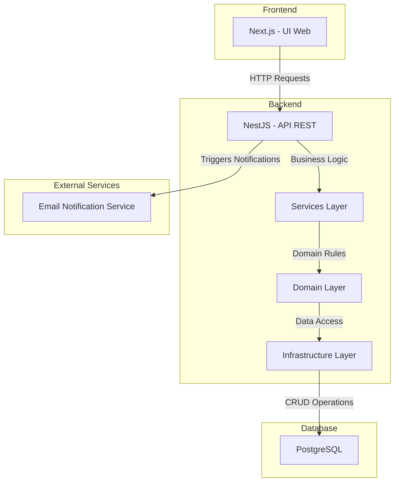
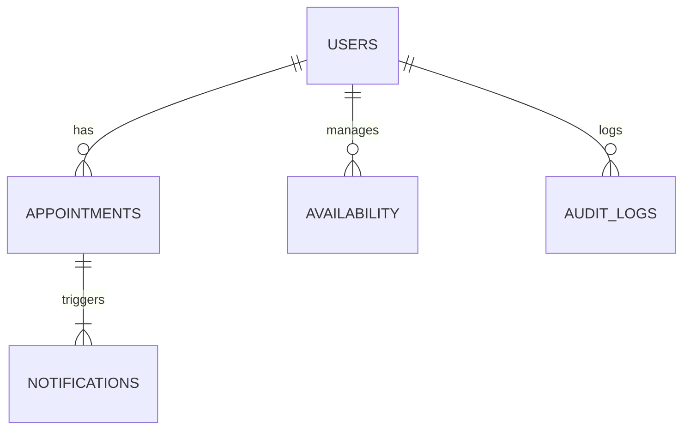
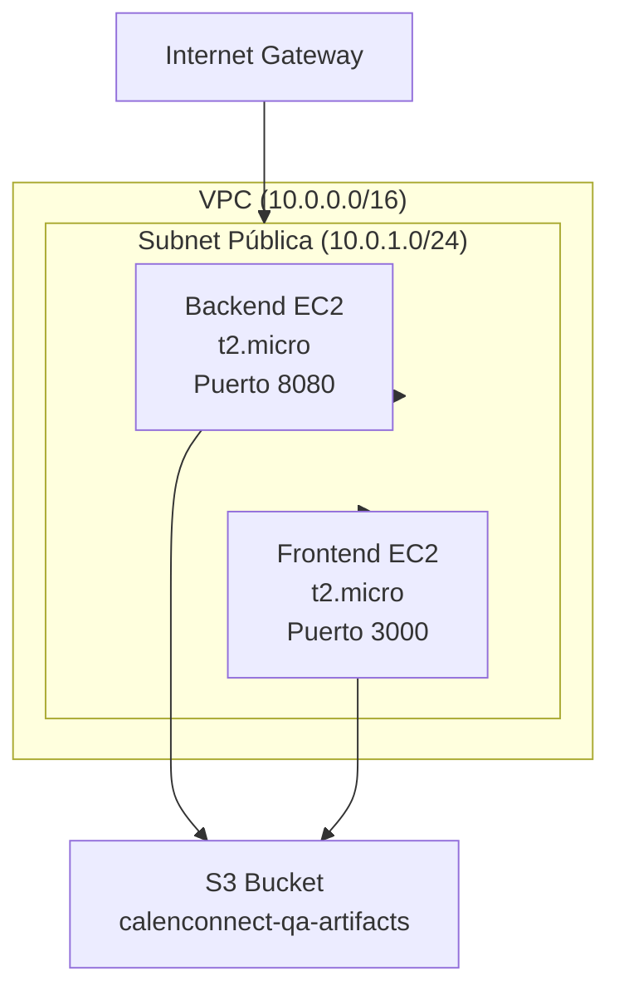

## Índice

0. [Ficha del proyecto](#0-ficha-del-proyecto)
1. [Descripción general del producto](#1-descripción-general-del-producto)
2. [Arquitectura del sistema](#2-arquitectura-del-sistema)
3. [Modelo de datos](#3-modelo-de-datos)
4. [Especificación de la API](#4-especificación-de-la-api)
5. [Historias de usuario](#5-historias-de-usuario)
6. [Tickets de trabajo](#6-tickets-de-trabajo)
7. [Pull requests](#7-pull-requests)

---

## 0. Ficha del proyecto

### **0.1. Tu nombre completo:** Jeferson David Camargo Herrera

### **0.2. Nombre del proyecto:** CalenConnect

### **0.3. Descripción breve del proyecto:**

### **Sistema de Agendamiento de Citas - MVP**  

El **Sistema de Agendamiento de Citas** es una plataforma web diseñada para facilitar la programación de citas entre pacientes y profesionales en áreas como psicología y bienestar. Su objetivo es optimizar la gestión de disponibilidad y mejorar la experiencia del usuario con un sistema ágil y funcional.  

#### **Características clave del MVP:**  
✅ Agendamiento, modificación y cancelación de citas.  
✅ Gestión manual de disponibilidad por parte de los profesionales.  
✅ Notificaciones automáticas por correo electrónico.  
✅ Mensajes en tiempo real sobre disponibilidad.  
✅ Cumplimiento con estándares de seguridad y privacidad de datos.  

💡 **Tecnologías utilizadas:**  
- **Frontend:** Next.js  
- **Backend:** NestJS  
- **Base de Datos:** PostgreSQL con Supabase  

El MVP está diseñado para ser escalable y servir como base para futuras mejoras, asegurando estabilidad, facilidad de uso y alta disponibilidad. 🚀


### **0.4. URL del proyecto:**


Para el proyecto final, estoy trabajando con **tres repositorios independientes** para tener un mayor control sobre los cambios en cada uno.  

1. **Repositorio Global:**  
   - Contiene la documentación del proyecto.  
   - Una vez se realice la entrega final, incluirá los proyectos de frontend y backend para tener todo unificado.  
   - **URL:** https://github.com/Jeferson96/AI4Devs-Final-Project-JDCH.git

2. **Repositorio Backend:**  
   - Se encarga de gestionar y hacer seguimiento del código del backend.  
   - **URL:** https://github.com/Jeferson96/calenconnect-api.git

3. **Repositorio Frontend:**  
   - Se encarga de almacenar y gestionar el código del frontend.  
   - **URL:** https://github.com/Jeferson96/calenconnect-ui.git  


### 0.5. Estado de Despliegue y URLs del Proyecto

📌 **Estado actual:** El proyecto se encuentra en fase de despliegue.

#### **Ambientes de Desarrollo:**

1. **Ambiente QA (Quality Assurance):**
   - Las URLs de acceso se actualizarán en esta documentación una vez el despliegue esté completado.
   - El progreso del despliegue puede seguirse en los respectivos repositorios.

#### **Repositorios del Proyecto:**
Cada repositorio mantiene su propia documentación específica, incluyendo:
- Instrucciones detalladas de instalación
- Configuración del entorno
- URLs de los ambientes desplegados

🔹 **Actualización de URLs:**
- Las URLs de los ambientes QA se agregarán en:
  - Este documento principal
  - README.md del repositorio frontend
  - README.md del repositorio backend
  - Documentación de la API

> Nota: Esta sección se actualizará automáticamente una vez el despliegue en QA esté completado y las URLs estén disponibles.


## **1. Descripción General del Producto**  

### **1.1 Objetivo**  

El **Sistema de Agendamiento de Citas** tiene como objetivo principal ofrecer una plataforma digital eficiente y accesible para la gestión de citas entre **pacientes** y **profesionales** del área de psicología y bienestar.  

Este MVP busca:  

✅ **Facilitar la programación de citas** entre pacientes y profesionales, permitiendo una experiencia fluida y sin complicaciones.  
✅ **Optimizar la gestión de disponibilidad**, permitiendo a los profesionales definir y modificar sus horarios de atención de manera manual.  
✅ **Asegurar una comunicación efectiva**, mediante **notificaciones automáticas** que confirman y recuerdan las citas programadas.  
✅ **Validar la aceptación del sistema**, proporcionando una versión funcional que pueda ser utilizada por usuarios reales antes de futuras mejoras.  
✅ **Garantizar seguridad y cumplimiento normativo**, protegiendo los datos de los usuarios según las regulaciones vigentes.  

---

### **1.2 Características y Funcionalidades Principales**  

El MVP incluye una serie de funcionalidades esenciales para garantizar su operación efectiva, organizadas en tres áreas clave:  

#### 🏥 **Gestión de Citas**  
- **Agendamiento de citas**: Los pacientes pueden seleccionar un profesional, elegir un horario disponible y confirmar su cita.  
- **Modificación y cancelación de citas**: Los pacientes pueden gestionar sus citas dentro de los parámetros definidos (mínimo 24 horas de anticipación).  
- **Mensajes en tiempo real**: Se notificará a los pacientes si la disponibilidad del profesional cambia durante el proceso de selección.  

#### 📅 **Gestión de Disponibilidad**  
- **Configuración manual de horarios**: Los profesionales pueden definir sus horarios de atención.  
- **Bloqueo de horarios y días completos**: Permite a los profesionales bloquear ciertos horarios o días si no están disponibles.  
- **Visualización de citas programadas**: Los profesionales pueden ver un listado de sus próximas citas en la plataforma.  

#### 📩 **Notificaciones y Seguridad**  
- **Notificaciones por correo electrónico**:  
  ✅ Confirmación de cita al agendar.  
  ✅ Recordatorios automáticos (24 horas y 1 hora antes).  
  ✅ Avisos en caso de modificación o cancelación.  
- **Seguridad y privacidad de datos**:  
  ✅ Uso de PostgreSQL con Supabase y reglas de seguridad RLS (Row Level Security).  
  ✅ Cumplimiento con la Ley 1581 de 2012 (Protección de Datos en Colombia).  
  ✅ Accesibilidad web conforme a estándares **WCAG**. 
  - Sistema de notificaciones 

🚀 **Tecnología utilizada:**  
- **Frontend:** React con TypeScript 
- **Backend:** NestJS  
- **Base de Datos:** PostgreSQL con Supabase  


### **1.3. Diseño y experiencia de usuario:**

Para una mejor comprensión del funcionamiento actual del proyecto, se han preparado recursos audiovisuales disponibles en el siguiente enlace:

📹 **Videos demostrativos:**
- **Ubicación:** [Carpeta de Videos en Google Drive](https://drive.google.com/drive/folders/1pL2zKpTF9GjnztG1J_vUYJ3pWwoTNizd?usp=sharing)
- **Contenido:**
  - Demo funcional del proyecto que incluye:
    - Proceso completo de agendamiento de citas
    - Gestión de disponibilidad por parte de los profesionales
    - Demostración de la interfaz de usuario y experiencia general
  - Tutorial de instalación y configuración que cubre:
    - Configuración del entorno de desarrollo
    - Instalación de dependencias necesarias
    - Configuración de la base de datos
    - Ejecución del proyecto en modo desarrollo

> **Nota:** Los videos están optimizados para una visualización clara y detallada de todas las funcionalidades del sistema.

### **1.4. Instrucciones de instalación y desarrollo:**

Para facilitar la puesta en marcha del proyecto en un entorno local, se ha preparado un video tutorial detallado:

📹 **Video de instalación y configuración:**
- [Tutorial de instalación paso a paso](URL_DEL_VIDEO) - Guía completa que cubre:
  - Configuración del entorno de desarrollo
  - Instalación de dependencias necesarias
  - Configuración de la base de datos
  - Ejecución del proyecto en modo desarrollo

Adicionalmente, se explica brevemente el proceso de desarrollo del proyecto.


---

## 2. Arquitectura del Sistema


## **2.1. Diagrama de Arquitectura**

A continuación, se presenta la arquitectura del **MVP del Sistema de Agendamiento de Citas**, detallando sus principales componentes y tecnologías utilizadas:



---

### **Patrón de Arquitectura Utilizado**  

📌 **Arquitectura en Capas con Principios de Clean Architecture y DDD (Domain-Driven Design)**  

El sistema sigue una **arquitectura en capas**, estructurada en cuatro niveles principales:  

1. **Capa de Presentación (Frontend - Next.js):**  
   - Interfaz web para la gestión de citas.  
   - Implementa Server-Side Rendering (SSR) e Incremental Static Regeneration (ISR) para optimizar la carga.  

2. **Capa de Aplicación (Backend - NestJS):**  
   - API REST centraliza la lógica de negocio.  
   - Manejo de reglas de disponibilidad y control de citas.  
   - Enrutamiento y controladores estructurados siguiendo **Clean Architecture**.  

3. **Capa de Datos (PostgreSQL):**  
   - Base de datos relacional optimizada para almacenar información de usuarios, citas y disponibilidad.  
   - ORM Prisma para gestión eficiente de datos.  

4. **Servicios Externos:**  
   - Módulo de **notificaciones** basado en Nodemailer y SendGrid para envío de correos electrónicos.  

---

### **Justificación de la Elección Arquitectónica**  

📌 **Motivos para elegir esta arquitectura:**  

✅ **Modularidad y mantenibilidad:**  
   - Uso de **Domain-Driven Design (DDD)** para estructurar los módulos en función de la lógica del negocio.  
   - Facilita la escalabilidad y la implementación de nuevas funcionalidades.  

✅ **Escalabilidad progresiva:**  
   - Separación de responsabilidades permite dividir la carga en microservicios en el futuro.  
   - Posibilidad de desacoplar el servicio de notificaciones y convertirlo en una cola de mensajes (RabbitMQ o Redis Pub/Sub).  

✅ **Alta disponibilidad y rendimiento:**  
   - PostgreSQL como base de datos garantiza consistencia e integridad de los datos.  
   - SSR e ISR en el frontend mejoran tiempos de carga.  

✅ **Seguridad y cumplimiento normativo:**  
   - Implementación de cifrado TLS para tráfico de datos.  
   - Diseño preparado para cumplir con normativas de privacidad como GDPR.  

---

### **Beneficios de esta Arquitectura**  

🔹 **Código más limpio y estructurado:**  
   - Uso de Clean Architecture con capas bien definidas.  
   - Facilita pruebas unitarias e integración.  

🔹 **Escalabilidad sin impacto en el rendimiento:**  
   - El backend está preparado para migrar a microservicios si es necesario.  
   - PostgreSQL puede manejar grandes volúmenes de citas sin pérdida de rendimiento.  

🔹 **Flexibilidad en futuras integraciones:**  
   - Posibilidad de añadir autenticación con OAuth 2.0 y JWT.  
   - Fácil integración con calendarios externos y pasarelas de pago.  

---

### **Sacrificios o Déficits de esta Arquitectura**  

⚠️ **No es completamente serverless:**  
   - El backend requiere infraestructura para su ejecución (por ejemplo, en AWS EC2 o DigitalOcean).  
   - No se usa Firebase o Supabase, lo que implica mayor esfuerzo en la gestión del backend.  

⚠️ **Procesamiento asíncrono limitado en el MVP:**  
   - No se incluye aún un sistema de colas para tareas de fondo (RabbitMQ, Kafka).  
   - El envío de correos podría ralentizar procesos en situaciones de alta demanda.  

⚠️ **Sin autenticación en el MVP:**  
   - No se implementa login de usuarios por ahora.  
   - Esto significa que cualquiera podría gestionar citas, lo cual es una limitación inicial.  

---

## **Conclusión**  

📌 La arquitectura elegida **balancea velocidad de desarrollo, modularidad y escalabilidad futura**.  

- **Beneficios**: Código limpio, mantenibilidad, rendimiento y seguridad.  
- **Limitaciones**: Falta de autenticación, sin colas asíncronas, no completamente serverless.  

🚀 En futuras versiones se prevé **optimización del procesamiento de notificaciones, autenticación y mejoras en la integración con terceros**.  

---


## **2.2. Descripción de Componentes Principales**

El sistema está compuesto por varias capas y módulos que trabajan en conjunto para proporcionar una experiencia fluida y confiable a los usuarios.

---

### **1️⃣ Capa de Presentación (Frontend)**
📌 **Tecnología utilizada:**  
✅ **Framework:** [Next.js](https://nextjs.org/)  
✅ **Lenguaje:** TypeScript  
✅ **Estado Global:** React Context API o Zustand  
✅ **Hosting:** Vercel o AWS S3 con CloudFront  

🔹 **Descripción:**  
El **frontend** proporciona la interfaz web para que los usuarios puedan interactuar con el sistema. Permite que los pacientes agenden citas, los profesionales gestionen su disponibilidad y que el flujo de información sea intuitivo y accesible.

🔹 **Características clave:**  
- Interfaz optimizada con **Server-Side Rendering (SSR)** y **Incremental Static Regeneration (ISR)**.  
- Experiencia de usuario fluida con **React Hooks y Componentes Reutilizables**.  
- Accesible según estándares **WCAG** para garantizar facilidad de uso.  

---

### **2️⃣ Capa de Aplicación (Backend)**
📌 **Tecnología utilizada:**  
✅ **Framework:** [NestJS](https://nestjs.com/)  
✅ **Lenguaje:** TypeScript  
✅ **ORM:** Prisma para conexión con la base de datos  
✅ **Validación de Datos:** Zod  
✅ **Servidor API:** Express (embebido en NestJS)  

🔹 **Descripción:**  
El **backend** maneja la lógica del negocio y procesa las solicitudes que llegan desde el frontend. Expone una **API REST** para permitir la interacción con los datos de citas, usuarios y disponibilidad.

🔹 **Características clave:**  
- **Arquitectura modular con Domain-Driven Design (DDD)**.  
- **Endpoints RESTful optimizados para alto rendimiento**.  
- **Gestión de reglas de disponibilidad y reservas de citas**.  
- **Validación estricta de datos para evitar inconsistencias**.  

---

### **3️⃣ Capa de Datos (Base de Datos)**
📌 **Tecnología utilizada:**  
✅ **Motor de Base de Datos:** [PostgreSQL](https://www.postgresql.org/)  
✅ **ORM:** Prisma  
✅ **Estrategia de Indexación:** Índices en `appointment_date` y `user_id`  
✅ **Modelo Relacional Optimizado**  

🔹 **Descripción:**  
La base de datos almacena toda la información de usuarios, citas, disponibilidad y logs de auditoría. Su diseño asegura **integridad referencial, rendimiento y escalabilidad**.

🔹 **Principales entidades:**  
| **Entidad** | **Descripción** |
|------------|------------------------------------------------------|
| **Users** | Almacena información de pacientes y profesionales. |
| **Appointments** | Registra las citas entre pacientes y profesionales. |
| **Availability** | Define la disponibilidad de los profesionales. |
| **Notifications** | Almacena las notificaciones enviadas. |
| **AuditLogs** | Guarda un registro de cambios en el sistema. |

🔹 **Modelo Relacional:**  


---

### **4️⃣ Servicio de Notificaciones**
📌 **Tecnología utilizada:**  
✅ **Envío de Correos:** Nodemailer + SendGrid  
✅ **Sistema de Eventos:** Integración futura con RabbitMQ o Redis Pub/Sub  

🔹 **Descripción:**  
Este módulo maneja el **envío de notificaciones automáticas** a pacientes y profesionales.

🔹 **Tipos de notificaciones:**  
✅ **Confirmación de cita** cuando el paciente agenda una sesión.  
✅ **Recordatorio de cita** antes de la fecha programada.  
✅ **Notificación de cancelación o modificación**.  

🔹 **Proceso de notificación:**  
1. **El usuario agenda/modifica/cancela una cita.**  
2. **El backend genera un evento de notificación.**  
3. **Se procesa la notificación y se envía por correo electrónico.**  
4. **Se registra en la base de datos para trazabilidad.**  

---

### **5️⃣ Infraestructura y Despliegue**
📌 **Tecnología utilizada:**  
✅ **Backend Hosting:** AWS EC2, DigitalOcean o Render  
✅ **Frontend Hosting:** Vercel o AWS S3 con CloudFront  
✅ **Base de Datos:** PostgreSQL en AWS RDS o Supabase  
✅ **Pipeline CI/CD:** GitHub Actions o GitLab CI/CD  

🔹 **Descripción:**  
La infraestructura está diseñada para **alta disponibilidad y escalabilidad**, permitiendo un despliegue eficiente y seguro del sistema.

🔹 **Componentes clave:**  
- **Backend en contenedores Docker** para garantizar portabilidad.  
- **CDN para el frontend** (Vercel o CloudFront) para optimizar la carga.  
- **Monitoreo con Prometheus + Grafana** para registrar métricas de uso.  

---

### **2.3. Descripción de alto nivel del proyecto y estructura de ficheros**

> Voy a analizar la estructura del proyecto para proporcionarte una explicación detallada.

Primero, veamos la estructura general del proyecto que está dividido en dos partes principales:

### 1. CalenConnect API (Backend)

La estructura sigue un patrón de arquitectura modular basado en NestJS, que es un framework para Node.js que implementa el patrón de arquitectura hexagonal (también conocido como puertos y adaptadores). 

Estructura principal:
```
calenconnect-api/
├── apps/                    # Aplicaciones principales
├── libs/                    # Bibliotecas compartidas
├── prisma/                  # Configuración y esquemas de base de datos
├── config/                  # Configuraciones de la aplicación
├── documentation/          # Documentación del proyecto
├── prompts/                # Prompts para IA
└── tests/                  # Pruebas unitarias y de integración
```

Características arquitectónicas:
- Implementa una arquitectura modular (NestJS)
- Sigue principios SOLID
- Utiliza Prisma como ORM
- Implementa patrones de diseño como Repository y Service
- Tiene una estructura de capas (Controllers, Services, Repositories)

### 2. CalenConnect UI (Frontend)

La estructura sigue un patrón de arquitectura moderna para aplicaciones React/Vite, implementando una arquitectura limpia y modular.

Estructura principal:
```
calenconnect-ui/
├── src/                    # Código fuente principal
├── public/                 # Archivos estáticos
├── components/            # Componentes reutilizables
├── lib/                   # Utilidades y helpers
├── styles/               # Estilos globales
└── types/                # Definiciones de tipos TypeScript
```

Características arquitectónicas:
- Implementa una arquitectura de componentes
- Utiliza Tailwind CSS para estilos
- Sigue el patrón de diseño Atomic Design
- Implementa una arquitectura limpia con separación de responsabilidades

### Patrones y Arquitecturas Implementados:

1. **Arquitectura Hexagonal (Puertos y Adaptadores)**:
   - Separación clara entre la lógica de negocio y las interfaces externas
   - Facilita la testabilidad y mantenibilidad

2. **Clean Architecture**:
   - Separación de responsabilidades
   - Independencia de frameworks
   - Testabilidad mejorada

3. **Domain-Driven Design (DDD)**:
   - Organización por dominios
   - Entidades y value objects
   - Agregados y servicios de dominio

4. **Microservicios**:
   - Separación clara entre frontend y backend
   - APIs independientes
   - Escalabilidad horizontal

5. **Patrón Repository**:
   - Abstracción de la capa de datos
   - Facilita el testing y mantenimiento

Esta arquitectura permite:
- Alta testabilidad
- Escalabilidad
- Mantenibilidad
- Separación clara de responsabilidades
- Facilidad para implementar nuevas características
- Independencia de tecnologías específicas


### **2.4. Infraestructura y despliegue**

### Diagrama de la Infraestructura



### Componentes de la Infraestructura

1. **Redes**:
   - VPC con CIDR 10.0.0.0/16
   - Subnet pública con CIDR 10.0.1.0/24
   - Internet Gateway para acceso a internet
   - Tabla de rutas configurada para tráfico público

2. **Seguridad**:
   - Grupos de seguridad separados para frontend y backend
   - Backend: puertos 8080 (aplicación) y 22 (SSH) abiertos
   - Frontend: puertos 3000 (aplicación) y 22 (SSH) abiertos
   - IAM Role con acceso a S3 para descargar artefactos

3. **Servidores**:
   - Backend: Instancia EC2 t2.micro con Node.js 20.x
   - Frontend: Instancia EC2 t2.micro con Nginx
   - AMI: Ubuntu 22.04 LTS

4. **Almacenamiento**:
   - Bucket S3 para almacenar artefactos de despliegue

### Proceso de Despliegue

1. **Preparación**:
   - Los artefactos (frontend.zip y backend.zip) se suben al bucket S3
   - Se utiliza el script `deploy-qa.sh` para automatizar el proceso

2. **Infraestructura**:
   - Terraform crea/modifica la infraestructura según la configuración
   - Se despliegan las instancias EC2 con sus respectivas configuraciones

3. **Configuración de Servidores**:
   - **Backend**:
     - Instalación de Node.js 20.x
     - Instalación de PM2 para gestión de procesos
     - Descarga y descompresión del backend desde S3
     - Inicio automático de la aplicación con PM2

   - **Frontend**:
     - Instalación de Nginx
     - Descarga y descompresión del frontend desde S3
     - Configuración de Nginx para servir la aplicación
     - Reinicio del servicio Nginx

4. **Verificación**:
   - El frontend estará disponible en el puerto 3000
   - El backend estará disponible en el puerto 8080
   - Ambos servicios son accesibles públicamente a través de sus respectivas IPs públicas

### Variables de Configuración

- Región: us-east-2
- Ambiente: qa
- Nombre del proyecto: calenconnect
- Tipo de instancia: t2.micro
- Bucket S3: calenconnect-qa-artifacts
- VPC CIDR: 10.0.0.0/16
- Subnet pública CIDR: 10.0.1.0/24
- AMI: Ubuntu 22.04 LTS

Esta infraestructura está diseñada para un ambiente de QA, con recursos optimizados para desarrollo y pruebas. La arquitectura es simple pero efectiva, permitiendo escalabilidad horizontal si es necesario.


## **2.5. Seguridad**  

La seguridad del **Sistema de Agendamiento de Citas** ha sido una prioridad en su diseño y desarrollo. Se han implementado diversas **prácticas de seguridad** para proteger la información de los usuarios y garantizar la integridad del sistema.  

A continuación, se detallan las principales medidas de seguridad aplicadas:

---

### **1️⃣ Protección de Datos y Cifrado**  
📌 **Objetivo:** Proteger la información sensible almacenada y transmitida.  

✅ **Cifrado en tránsito:**  
- Todo el tráfico de datos entre el frontend y backend está protegido mediante **TLS 1.3**.  
- Se utiliza **HTTPS** para evitar ataques como **Man-in-the-Middle (MITM)**.  

✅ **Cifrado en reposo:**  
- Se implementa **cifrado AES-256** para almacenar datos sensibles en la base de datos.  
- Se evita el almacenamiento de información sensible en texto plano.  

✅ **Protección de contraseñas (Futuras versiones):**  
- Se usará **bcrypt** o **Argon2** para el hashing de contraseñas.  

---

### **2️⃣ Seguridad en la Base de Datos**  
📌 **Objetivo:** Proteger la integridad y confidencialidad de los datos.  

✅ **Principio de Mínimos Privilegios (Least Privilege Principle):**  
- Cada servicio tiene permisos específicos en la base de datos.  
- No se permite acceso directo a la base de datos desde el frontend.  

✅ **Validaciones y restricciones:**  
- Uso de **constraints** para evitar inconsistencias en las relaciones entre tablas.  
- Implementación de **índices y claves foráneas** para garantizar integridad referencial.  

✅ **Prevención de SQL Injection:**  
- Uso de **ORM Prisma**, que genera consultas parametrizadas para evitar inyecciones SQL.  

---

### **3️⃣ Validación de Datos y Protección contra Ataques**  
📌 **Objetivo:** Prevenir ataques basados en entradas maliciosas y mejorar la confiabilidad del sistema.  

✅ **Validación de entradas con Zod:**  
- Se verifica que los datos ingresados por los usuarios sean correctos antes de ser procesados.  
- Ejemplo: Un usuario no puede enviar una fecha de cita en formato incorrecto.  

✅ **Protección contra Cross-Site Scripting (XSS):**  
- Se sanitizan las entradas de datos en el frontend y backend para evitar inyecciones de scripts maliciosos.  

✅ **Protección contra Cross-Site Request Forgery (CSRF):**  
- Se implementarán **tokens CSRF** en futuras versiones para prevenir solicitudes malintencionadas.  

✅ **Rate Limiting para protección contra DoS/DDoS:**  
- Se limita el número de solicitudes por minuto en la API para evitar ataques de denegación de servicio.  
- Ejemplo: Un usuario no puede hacer más de 10 intentos de modificación de citas en un minuto.  

---

### **4️⃣ Autenticación y Autorización (Futuras versiones)**  
📌 **Objetivo:** Asegurar el acceso solo a usuarios autorizados.  

✅ **JWT (JSON Web Token) con Refresh Tokens:**  
- Se implementará para autenticación segura en futuras versiones.  
- Cada usuario tendrá un token único con expiración.  

✅ **Roles y permisos con RBAC (Role-Based Access Control):**  
- Diferenciación de accesos entre **pacientes, profesionales y administradores**.  
- Ejemplo: Un paciente no puede modificar la disponibilidad de un profesional.  

✅ **OAuth 2.0 / OpenID Connect:**  
- Se planea permitir login con cuentas de Google y otros servicios externos.  

---

### **5️⃣ Seguridad en Infraestructura y Monitoreo**  
📌 **Objetivo:** Garantizar la estabilidad y detectar amenazas en tiempo real.  

✅ **Backups automáticos:**  
- Copias de seguridad diarias de la base de datos con retención configurable.  

✅ **Monitoreo con Prometheus + Grafana:**  
- Registro de logs y alertas en tiempo real para detectar anomalías.  

✅ **Sistemas de detección de intrusos (IDS) y auditoría:**  
- Se implementará un módulo de **audit logs** para registrar eventos sospechosos.  

✅ **Rollback en despliegues:**  
- Implementación de **blue-green deployment** para evitar fallos en actualizaciones.  

---


### **2.6. Tests**


### Tests de Integración

1. **AppointmentModule**:
   - Pruebas de creación y gestión de citas
   - Verificación del estado de las citas (SCHEDULED, COMPLETED)

2. **AvailabilityModule**:
   - Prueba de creación de disponibilidades (`createAvailability`)
   - Búsqueda de slots disponibles (`findAvailableSlots`)
   - Verificación de persistencia en base de datos
   - Validación de horarios (10-11 AM, 2-3 PM)

3. **UserModule**:
   - Creación de usuarios (`createUser`)
   - Verificación de persistencia de datos del usuario
   - Validación de roles (PROFESSIONAL)

### Tests Unitarios

1. **AppointmentEntity**:
   - Validación de creación de citas
   - Manejo de fechas pasadas y futuras
   - Validación de campos obligatorios (patientId, professionalId)
   - Estado por defecto de las citas

2. **AvailabilityEntity**:
   - Creación de disponibilidades
   - Validación de propiedades
   - Manejo del estado `isBooked`

### Tests de Repositorio

1. **PrismaAppointmentRepository**:
   - Operaciones CRUD básicas
   - Búsqueda por ID
   - Manejo de casos con IDs inexistentes

2. **PrismaAvailabilityRepository**:
   - Búsqueda por ID
   - Búsqueda por professionalId
   - Manejo de casos con datos no existentes

Todos los tests incluyen validaciones de persistencia en base de datos y manejan tanto casos exitosos como casos de error.


---

## 3. Modelo de Datos

### **3.1. Diagrama del modelo de datos:**

erDiagram
    USERS {
        uuid id PK
        string first_name
        string last_name
        string email UNIQUE
        string role ENUM('PATIENT', 'PROFESSIONAL')
        timestamp created_at
        timestamp updated_at
    }
    
    APPOINTMENTS {
        uuid id PK
        uuid patient_id FK -> USERS.id
        uuid professional_id FK -> USERS.id
        timestamp appointment_date
        string status ENUM('SCHEDULED', 'CANCELLED', 'COMPLETED')
        timestamp created_at
        timestamp updated_at
    }

    AVAILABILITY {
        uuid id PK
        uuid professional_id FK -> USERS.id
        timestamp available_date
        time start_time
        time end_time
        boolean is_booked DEFAULT FALSE
        timestamp created_at
        timestamp updated_at
    }

    NOTIFICATIONS {
        uuid id PK
        uuid user_id FK -> USERS.id
        uuid appointment_id FK -> APPOINTMENTS.id
        string type ENUM('CONFIRMATION', 'REMINDER', 'CANCELLATION')
        boolean is_sent DEFAULT FALSE
        timestamp sent_at
    }

    AUDIT_LOGS {
        uuid id PK
        uuid user_id FK -> USERS.id
        string action
        json metadata
        timestamp created_at
    }

    USERS ||--o{ APPOINTMENTS : has
    USERS ||--o{ AVAILABILITY : manages
    APPOINTMENTS ||--|{ NOTIFICATIONS : triggers
    USERS ||--o{ AUDIT_LOGS : logs


---

## **3.2. Descripción de Entidades Principales**

El modelo de datos del sistema está diseñado para garantizar **integridad referencial, rendimiento y escalabilidad**. Se sigue un enfoque **relacional normalizado (Tercera Forma Normal - 3NF)** para evitar redundancias y optimizar consultas.

### **📌 Modelo Relacional (ERD - Entidades y Relaciones)**  


---

## **1️⃣ Entidad: Users (Usuarios)**
📌 **Descripción:** Almacena información de los usuarios del sistema (pacientes y profesionales).

| **Atributo**     | **Tipo de Dato**      | **Descripción**                         | **Restricciones**                     |
|------------------|----------------------|-----------------------------------------|---------------------------------------|
| id              | `UUID`                 | Identificador único del usuario        | `PRIMARY KEY`                         |
| first_name      | `VARCHAR(50)`          | Nombre del usuario                     | `NOT NULL`                            |
| last_name       | `VARCHAR(50)`          | Apellido del usuario                   | `NOT NULL`                            |
| email           | `VARCHAR(100)`         | Correo electrónico                     | `UNIQUE, NOT NULL`                    |
| role            | `ENUM('PATIENT', 'PROFESSIONAL')` | Tipo de usuario                      | `NOT NULL`                            |
| created_at      | `TIMESTAMP`            | Fecha de creación del usuario          | `DEFAULT NOW()`                        |
| updated_at      | `TIMESTAMP`            | Última actualización                   | `DEFAULT NOW()`                        |

🔹 **Relaciones:**  
- Un usuario puede tener **varias citas (APPOINTMENTS)**.  
- Un usuario (si es profesional) gestiona su **disponibilidad (AVAILABILITY)**.  
- Un usuario puede generar eventos en el **log de auditoría (AUDIT_LOGS)**.  

---

## **2️⃣ Entidad: Appointments (Citas)**
📌 **Descripción:** Registra la información de las citas entre pacientes y profesionales.

| **Atributo**       | **Tipo de Dato**      | **Descripción**                          | **Restricciones**                     |
|--------------------|----------------------|------------------------------------------|---------------------------------------|
| id                | `UUID`                | Identificador único de la cita          | `PRIMARY KEY`                         |
| patient_id        | `UUID`                | ID del paciente que agenda la cita      | `FOREIGN KEY -> USERS(id) NOT NULL`   |
| professional_id   | `UUID`                | ID del profesional que atiende la cita  | `FOREIGN KEY -> USERS(id) NOT NULL`   |
| appointment_date  | `TIMESTAMP`           | Fecha y hora de la cita                 | `NOT NULL, INDEXED`                   |
| status           | `ENUM('SCHEDULED', 'CANCELLED', 'COMPLETED')` | Estado de la cita | `DEFAULT 'SCHEDULED'` |
| created_at        | `TIMESTAMP`           | Fecha de creación del registro          | `DEFAULT NOW()`                        |
| updated_at        | `TIMESTAMP`           | Última actualización                    | `DEFAULT NOW()`                        |

🔹 **Relaciones:**  
- Cada cita tiene **un paciente y un profesional**.  
- Una cita puede generar **notificaciones (NOTIFICATIONS)**.  

---

## **3️⃣ Entidad: Availability (Disponibilidad)**
📌 **Descripción:** Define los horarios disponibles de los profesionales.

| **Atributo**      | **Tipo de Dato**      | **Descripción**                         | **Restricciones**                     |
|------------------|----------------------|-----------------------------------------|---------------------------------------|
| id              | `UUID`                 | Identificador único de la disponibilidad | `PRIMARY KEY`                         |
| professional_id | `UUID`                 | ID del profesional                     | `FOREIGN KEY -> USERS(id) NOT NULL`   |
| available_date  | `DATE`                 | Fecha disponible                        | `NOT NULL`                            |
| start_time      | `TIME`                 | Hora de inicio                          | `NOT NULL`                            |
| end_time        | `TIME`                 | Hora de fin                             | `NOT NULL`                            |
| is_booked       | `BOOLEAN`              | Indica si el horario ya está reservado  | `DEFAULT FALSE`                       |
| created_at      | `TIMESTAMP`            | Fecha de creación                       | `DEFAULT NOW()`                        |
| updated_at      | `TIMESTAMP`            | Última actualización                    | `DEFAULT NOW()`                        |

🔹 **Relaciones:**  
- Un **profesional** puede tener **múltiples disponibilidades**.  
- La disponibilidad se usa para **validar si se puede agendar una cita**.  

---

## **4️⃣ Entidad: Notifications (Notificaciones)**
📌 **Descripción:** Almacena las notificaciones enviadas a los usuarios.

| **Atributo**      | **Tipo de Dato**      | **Descripción**                         | **Restricciones**                     |
|------------------|----------------------|-----------------------------------------|---------------------------------------|
| id              | `UUID`                 | Identificador único de la notificación | `PRIMARY KEY`                         |
| user_id        | `UUID`                 | ID del usuario notificado               | `FOREIGN KEY -> USERS(id) NOT NULL`   |
| appointment_id | `UUID`                 | ID de la cita relacionada               | `FOREIGN KEY -> APPOINTMENTS(id) NOT NULL` |
| type            | `ENUM('CONFIRMATION', 'REMINDER', 'CANCELLATION')` | Tipo de notificación | `NOT NULL` |
| is_sent         | `BOOLEAN`              | Indica si el correo fue enviado         | `DEFAULT FALSE`                       |
| sent_at         | `TIMESTAMP`            | Fecha de envío                          | `NULLABLE`                            |

🔹 **Relaciones:**  
- Cada notificación está **asociada a una cita**.  
- Cada notificación está **dirigida a un usuario** (paciente o profesional).  

---

## **5️⃣ Entidad: Audit Logs (Registros de Auditoría)**
📌 **Descripción:** Guarda eventos importantes en el sistema para auditoría y seguridad.

| **Atributo**      | **Tipo de Dato**      | **Descripción**                         | **Restricciones**                     |
|------------------|----------------------|-----------------------------------------|---------------------------------------|
| id              | `UUID`                 | Identificador único del log            | `PRIMARY KEY`                         |
| user_id        | `UUID`                 | ID del usuario que generó el evento    | `FOREIGN KEY -> USERS(id) NOT NULL`   |
| action         | `VARCHAR(255)`          | Acción registrada (ej. "Canceló cita") | `NOT NULL`                            |
| metadata       | `JSON`                  | Datos adicionales                      | `NULLABLE`                            |
| created_at      | `TIMESTAMP`            | Fecha de generación                    | `DEFAULT NOW()`                        |

🔹 **Relaciones:**  
- Registra **acciones realizadas por los usuarios**.  
- Se puede usar para **trazabilidad y monitoreo de seguridad**.  

---


## 4. Especificación de la API

> Si tu backend se comunica a través de API, describe los endpoints principales (máximo 3) en formato OpenAPI. Opcionalmente puedes añadir un ejemplo de petición y de respuesta para mayor claridad

---

## 5. Historias de Usuario

> Documenta 3 de las historias de usuario principales utilizadas durante el desarrollo, teniendo en cuenta las buenas prácticas de producto al respecto.

### **Historia de Usuario 1: Agendamiento de Citas**

**Título:** Como paciente, quiero agendar una cita con un profesional disponible para recibir atención en un horario conveniente.

**Descripción:**  
Los pacientes deben poder seleccionar un profesional, ver su disponibilidad y programar una cita dentro del horario permitido. Una vez confirmada, la cita debe registrarse en el sistema y enviarse una notificación de confirmación por correo electrónico.

**Criterios de Aceptación:**  
✅ El paciente puede ver una lista de profesionales disponibles.  
✅ El paciente puede seleccionar un profesional y ver sus horarios disponibles.  
✅ El paciente puede elegir una fecha y hora dentro de la disponibilidad del profesional.  
✅ La cita se registra en la base de datos con el estado "Agendada".  
✅ Se envía una notificación de confirmación por correo electrónico al paciente y al profesional.  
✅ Si no hay disponibilidad en la fecha seleccionada, el paciente recibe un mensaje indicándolo.

**Prioridad:** Alta  
**Dependencias:** Gestión de disponibilidad de los profesionales, Sistema de notificaciones.

----------

### **Historia de Usuario 2: Modificación y Cancelación de Citas**

**Título:** Como paciente, quiero modificar o cancelar una cita con al menos 24 horas de anticipación para ajustar mi disponibilidad.

**Descripción:**  
Los pacientes deben tener la posibilidad de modificar o cancelar sus citas siempre que lo hagan con **al menos 24 horas de antelación**, según la configuración del sistema. Cualquier cambio debe reflejarse en la base de datos y generar una notificación automática para el paciente y el profesional.

**Criterios de Aceptación:**  
✅ El paciente puede acceder a su historial de citas.  
✅ El paciente puede seleccionar una cita y optar por modificarla o cancelarla.  
✅ El sistema valida que la acción se realiza con al menos **24 horas de anticipación**.  
✅ Si la acción no está permitida (menos de 24 horas antes), el sistema muestra un mensaje indicando la restricción.  
✅ Si la modificación/cancelación es válida, se actualiza el estado de la cita en la base de datos.  
✅ Se envía una **notificación por correo** al paciente y al profesional sobre el cambio.

**Prioridad:** Alta  
**Dependencias:** Gestión de citas, Sistema de notificaciones.

----------

### **Historia de Usuario 3: Gestión de Disponibilidad por Parte del Profesional**

**Título:** Como profesional, quiero gestionar manualmente mi disponibilidad para definir los horarios en los que puedo atender citas.

**Descripción:**  
Los profesionales deben poder establecer su disponibilidad dentro del horario permitido (**7:00 a.m. - 5:00 p.m., parametrizable**). Deben poder bloquear horarios específicos o días completos cuando no estén disponibles.

**Criterios de Aceptación:**  
✅ El profesional puede acceder a su panel de disponibilidad.  
✅ El profesional puede definir sus horarios disponibles dentro del rango permitido.  
✅ El profesional puede bloquear horarios específicos o días completos.  
✅ Los cambios en la disponibilidad se reflejan en el sistema en tiempo real.  
✅ Si un horario bloqueado ya tiene citas agendadas, el sistema muestra una advertencia y evita el bloqueo hasta que las citas sean reprogramadas o canceladas.  
✅ Los pacientes solo pueden ver y seleccionar horarios disponibles según la configuración del profesional.

**Prioridad:** Alta  
**Dependencias:** Agendamiento de citas, Base de datos de disponibilidad.

----------

---

## 6. Tickets de Trabajo

> Documenta 3 de los tickets de trabajo principales del desarrollo, uno de backend, uno de frontend, y uno de bases de datos. Da todo el detalle requerido para desarrollar la tarea de inicio a fin teniendo en cuenta las buenas prácticas al respecto. 

**Ticket 1**

----------

### **📌 Ticket 6: Configuración de Comunicación con el Backend**

📌 **Épica:** Configuración del Proyecto Frontend

**Título:** Configurar la comunicación con el backend mediante API REST

**Descripción:**  
Se debe establecer un **módulo de comunicación con el backend** utilizando **fetch o axios**, asegurando una gestión eficiente de las solicitudes y respuestas. Este módulo debe seguir los principios de **Clean Architecture y Vertical Slicing** para garantizar una integración estructurada y escalable.

**Tareas:**

-   Instalar y configurar **axios** como cliente HTTP (opcional si se decide usar fetch).
-   Crear un **servicio centralizado** para gestionar las peticiones al backend.
-   Configurar **manejo global de errores** en las solicitudes API.
-   Definir una **configuración global** para URLs base y encabezados.
-   Documentar la estructura y el uso del módulo de comunicación en el repositorio.

**Criterios de Aceptación:**  
✅ El sistema de comunicación con el backend está implementado y centralizado.  
✅ Se ha configurado un manejo de errores adecuado en las solicitudes API.  
✅ La configuración global de URLs y encabezados está correctamente definida.  
✅ Existe una documentación clara en el repositorio sobre la integración con el backend.

**Prioridad:** Alta  
**Dependencias:** Configuración de Rutas y Navegación en el Frontend.

----------


**Ticket 2**

----------

### **📌 Ticket 3: Definición de la Estructura de Carpetas y Organización del Código en el Backend**

📌 **Épica:** Configuración del Proyecto Backend

**Título:** Definir la estructura de carpetas y organización del código en el backend

**Descripción:**  
Se debe establecer una **estructura modular y escalable** en el backend siguiendo **Clean Architecture, Hexagonal Architecture y DDD**, asegurando una separación clara entre las capas de dominio, aplicación, infraestructura y presentación.

**Tareas:**

-   Definir y crear las **carpetas principales** del backend (`src/domain`, `src/application`, `src/infrastructure`, `src/presentation`).
-   Separar las capas de **dominio (entidades), aplicación (casos de uso), infraestructura (repositorios, conexión a BD) y presentación (controladores y rutas)**.
-   Implementar una carpeta dedicada para **configuración global** (variables de entorno, seguridad).
-   Asegurar que la estructura permite la **escalabilidad y mantenibilidad** del proyecto.
-   Documentar la estructura de carpetas y principios de organización en el repositorio.

**Criterios de Aceptación:**  
✅ La estructura de carpetas sigue los principios de **Clean Architecture y DDD**.  
✅ Se han separado correctamente las capas de dominio, aplicación, infraestructura y presentación.  
✅ Existe una documentación clara en el repositorio sobre la organización del código.

**Prioridad:** Alta  
**Dependencias:** Configuración de la Base de Datos con Supabase.

----------

**Ticket 3**


----------

## **📌 Tickets Funcionalidades Principales**


### **📌 Ticket 1: Implementación del Agendamiento de Citas**

📌 **Épica:** Gestión de Citas

**Título:** Implementar la funcionalidad de agendamiento de citas en el sistema

**Descripción:**  
Se debe desarrollar la funcionalidad que permita a los **pacientes** agendar citas con los **profesionales** según su disponibilidad. La cita debe registrarse en la base de datos y generar una confirmación por correo electrónico.

**Tareas:**

-   Crear el **endpoint en el backend** para registrar una cita.
-   Validar que la fecha y hora seleccionadas estén **disponibles** antes de confirmar la cita.
-   Implementar la **interfaz en el frontend** para que los pacientes puedan seleccionar un profesional y su disponibilidad.
-   Integrar la funcionalidad con el sistema de **notificaciones** para enviar confirmaciones por correo.
-   Documentar el flujo de agendamiento en el repositorio.

**Criterios de Aceptación:**  
✅ Un paciente puede seleccionar un **profesional, fecha y hora** para agendar su cita.  
✅ La cita se **registra correctamente en la base de datos** con estado "Agendada".  
✅ Se **envía una confirmación por correo** al paciente y al profesional.  
✅ Se valida la disponibilidad antes de confirmar la cita.  
✅ Existe una documentación clara en el repositorio sobre el flujo de agendamiento.

**Prioridad:** Alta  
**Dependencias:** Configuración del Backend y Frontend completada.

----------

---

## 7. Pull Requests

> Documenta 3 de las Pull Requests realizadas durante la ejecución del proyecto

**Pull Request 1**

**Pull Request 2**

**Pull Request 3**

