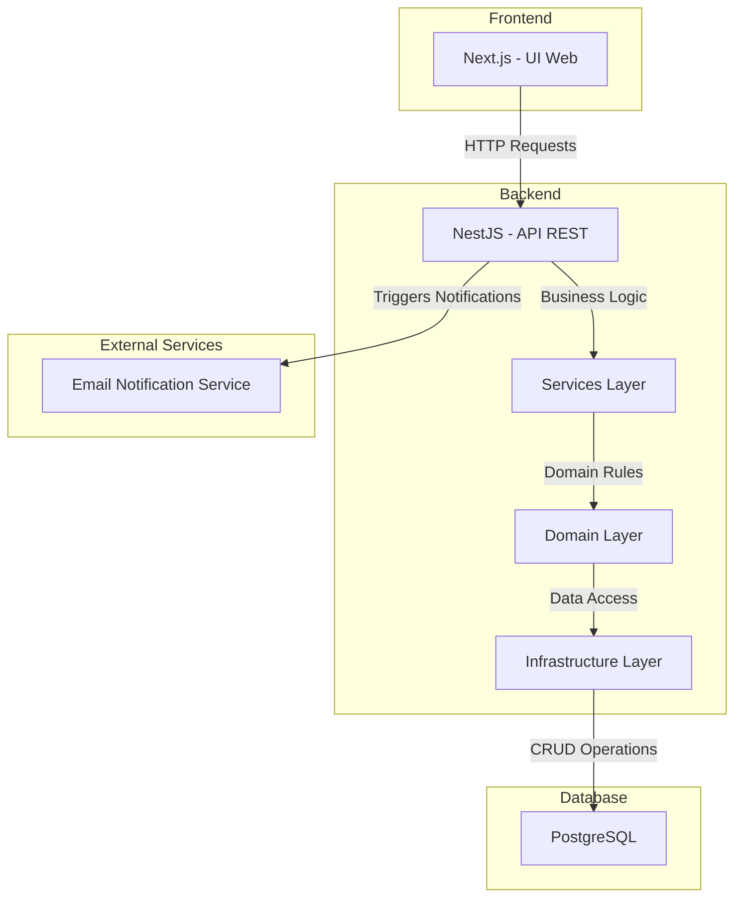
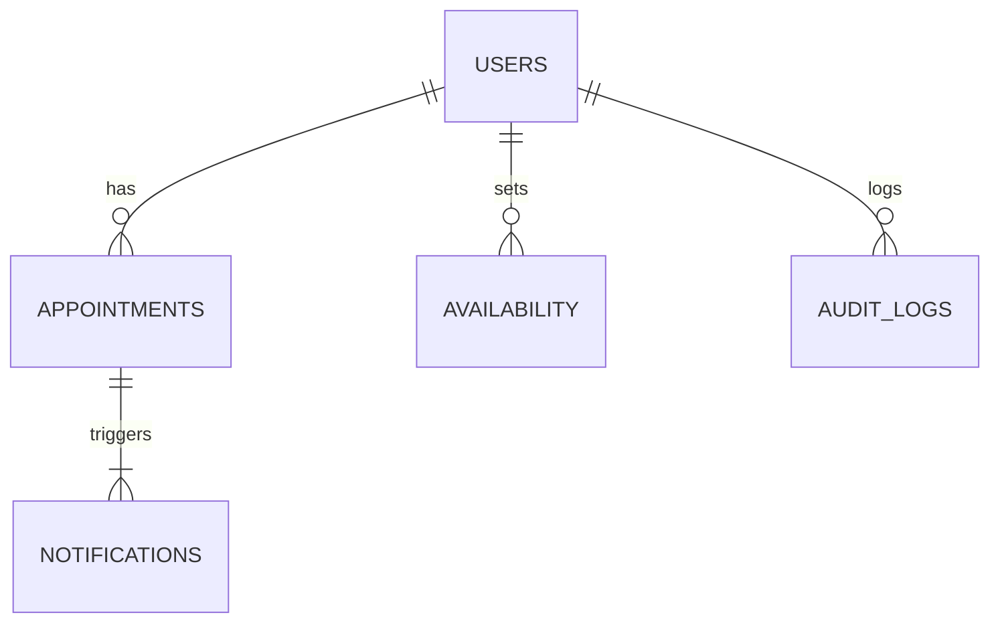
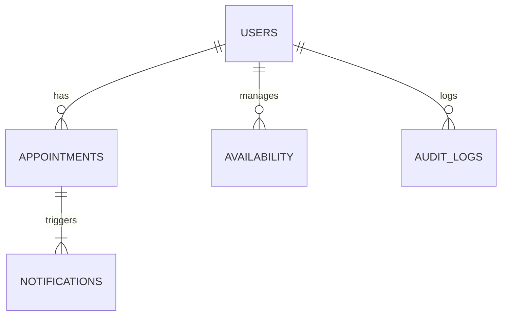

## Índice

0. [Ficha del proyecto](#0-ficha-del-proyecto)
1. [Descripción general del producto](#1-descripción-general-del-producto)
2. [Arquitectura del sistema](#2-arquitectura-del-sistema)
3. [Modelo de datos](#3-modelo-de-datos)
4. [Especificación de la API](#4-especificación-de-la-api)
5. [Historias de usuario](#5-historias-de-usuario)
6. [Tickets de trabajo](#6-tickets-de-trabajo)
7. [Pull requests](#7-pull-requests)

---

## 0. Ficha del proyecto

### **0.1. Tu nombre completo:** Jeferson David Camargo Herrera

### **0.2. Nombre del proyecto:**

### **0.3. Descripción breve del proyecto:**

### **0.4. URL del proyecto:**

> Puede ser pública o privada, en cuyo caso deberás compartir los accesos de manera segura. Puedes enviarlos a [alvaro@lidr.co](mailto:alvaro@lidr.co) usando algún servicio como [onetimesecret](https://onetimesecret.com/).

### 0.5. URL o archivo comprimido del repositorio

> Puedes tenerlo alojado en público o en privado, en cuyo caso deberás compartir los accesos de manera segura. Puedes enviarlos a [alvaro@lidr.co](mailto:alvaro@lidr.co) usando algún servicio como [onetimesecret](https://onetimesecret.com/). También puedes compartir por correo un archivo zip con el contenido

---

## **1. Descripción General del Producto**

### **1.1 Objetivo**  

El **Sistema de Agendamiento de Citas** es una plataforma diseñada para facilitar la programación, gestión y control de citas entre profesionales y clientes en el sector de la **psicología y áreas relacionadas**.  

El propósito principal del producto es proporcionar una **solución eficiente y accesible** para la administración de citas, permitiendo que los profesionales gestionen su disponibilidad y que los pacientes puedan reservar sesiones de manera sencilla y organizada.  

### **Valor que aporta:**  
✅ **Automatización del proceso de agendamiento**, eliminando la necesidad de coordinación manual.  
✅ **Mejor gestión del tiempo y recursos** para los profesionales.  
✅ **Experiencia fluida e intuitiva** para los pacientes al reservar citas.  
✅ **Reducción de cancelaciones y ausencias** mediante notificaciones automáticas.  

### **¿Qué problema soluciona?**  
🔹 Evita la sobrecarga administrativa de los profesionales al gestionar sus citas manualmente.  
🔹 Reduce la fricción en la comunicación entre pacientes y profesionales.  
🔹 Disminuye la tasa de inasistencia mediante recordatorios automatizados.  

### **¿Para quién está diseñado?**  

📌 **Pacientes/Clientes:**  
- Personas que requieren reservar sesiones con profesionales de la salud mental.  

📌 **Profesionales:**  
- Psicólogos y especialistas que necesitan gestionar su disponibilidad y citas.  

📌 **Administradores:**  
- Personal encargado de validar citas, gestionar disponibilidad y configurar reglas en la plataforma.  

---

### **1.2 Características y Funcionalidades Principales**  

El MVP del Sistema de Agendamiento de Citas incluye las siguientes funcionalidades clave:  

| **Funcionalidad**            | **Descripción** |
|-----------------------------|------------------------------------------------|
| **Agendamiento de Citas**   | Los pacientes pueden reservar citas con profesionales disponibles. |
| **Modificación y Cancelación** | Los pacientes pueden modificar o cancelar citas según las reglas establecidas. |
| **Gestión de Disponibilidad** | Los profesionales pueden definir y actualizar manualmente sus horarios. |
| **Notificaciones Automáticas** | Se enviarán correos electrónicos de confirmación y recordatorios de citas. |
| **Interfaz Intuitiva** | Plataforma fácil de usar, accesible para todos los usuarios. |
| **Seguridad y Privacidad** | Protección de datos personales conforme a normativas de privacidad. |
| **Alta Disponibilidad** | Garantiza una operatividad mínima del 99% del tiempo. |

📌 **Exclusiones del MVP:**  
❌ No incluye autenticación ni registro de usuarios.  
❌ No permite integración con calendarios externos.  
❌ No ofrece pagos en línea ni reportes avanzados.  

🔹 **Futuras mejoras previstas:** Integración con pasarelas de pago, sincronización con calendarios externos, reportes avanzados y mensajería vía WhatsApp.  

---

### **1.3. Diseño y experiencia de usuario:**

> Proporciona imágenes y/o videotutorial mostrando la experiencia del usuario desde que aterriza en la aplicación, pasando por todas las funcionalidades principales.

### **1.4. Instrucciones de instalación:**
> Documenta de manera precisa las instrucciones para instalar y poner en marcha el proyecto en local (librerías, backend, frontend, servidor, base de datos, migraciones y semillas de datos, etc.)

---

## 2. Arquitectura del Sistema

## **2.1. Diagrama de Arquitectura**

A continuación, se presenta la arquitectura del **MVP del Sistema de Agendamiento de Citas**, detallando sus principales componentes y tecnologías utilizadas:

---

### **Patrón de Arquitectura Utilizado**  

📌 **Arquitectura en Capas con Principios de Clean Architecture y DDD (Domain-Driven Design)**  

El sistema sigue una **arquitectura en capas**, estructurada en cuatro niveles principales:  

1. **Capa de Presentación (Frontend - Next.js):**  
   - Interfaz web para la gestión de citas.  
   - Implementa Server-Side Rendering (SSR) e Incremental Static Regeneration (ISR) para optimizar la carga.  

2. **Capa de Aplicación (Backend - NestJS):**  
   - API REST centraliza la lógica de negocio.  
   - Manejo de reglas de disponibilidad y control de citas.  
   - Enrutamiento y controladores estructurados siguiendo **Clean Architecture**.  

3. **Capa de Datos (PostgreSQL):**  
   - Base de datos relacional optimizada para almacenar información de usuarios, citas y disponibilidad.  
   - ORM Prisma para gestión eficiente de datos.  

4. **Servicios Externos:**  
   - Módulo de **notificaciones** basado en Nodemailer y SendGrid para envío de correos electrónicos.  

---

### **Justificación de la Elección Arquitectónica**  

📌 **Motivos para elegir esta arquitectura:**  

✅ **Modularidad y mantenibilidad:**  
   - Uso de **Domain-Driven Design (DDD)** para estructurar los módulos en función de la lógica del negocio.  
   - Facilita la escalabilidad y la implementación de nuevas funcionalidades.  

✅ **Escalabilidad progresiva:**  
   - Separación de responsabilidades permite dividir la carga en microservicios en el futuro.  
   - Posibilidad de desacoplar el servicio de notificaciones y convertirlo en una cola de mensajes (RabbitMQ o Redis Pub/Sub).  

✅ **Alta disponibilidad y rendimiento:**  
   - PostgreSQL como base de datos garantiza consistencia e integridad de los datos.  
   - SSR e ISR en el frontend mejoran tiempos de carga.  

✅ **Seguridad y cumplimiento normativo:**  
   - Implementación de cifrado TLS para tráfico de datos.  
   - Diseño preparado para cumplir con normativas de privacidad como GDPR.  

---

### **Beneficios de esta Arquitectura**  

🔹 **Código más limpio y estructurado:**  
   - Uso de Clean Architecture con capas bien definidas.  
   - Facilita pruebas unitarias e integración.  

🔹 **Escalabilidad sin impacto en el rendimiento:**  
   - El backend está preparado para migrar a microservicios si es necesario.  
   - PostgreSQL puede manejar grandes volúmenes de citas sin pérdida de rendimiento.  

🔹 **Flexibilidad en futuras integraciones:**  
   - Posibilidad de añadir autenticación con OAuth 2.0 y JWT.  
   - Fácil integración con calendarios externos y pasarelas de pago.  

---

### **Sacrificios o Déficits de esta Arquitectura**  

⚠️ **No es completamente serverless:**  
   - El backend requiere infraestructura para su ejecución (por ejemplo, en AWS EC2 o DigitalOcean).  
   - No se usa Firebase o Supabase, lo que implica mayor esfuerzo en la gestión del backend.  

⚠️ **Procesamiento asíncrono limitado en el MVP:**  
   - No se incluye aún un sistema de colas para tareas de fondo (RabbitMQ, Kafka).  
   - El envío de correos podría ralentizar procesos en situaciones de alta demanda.  

⚠️ **Sin autenticación en el MVP:**  
   - No se implementa login de usuarios por ahora.  
   - Esto significa que cualquiera podría gestionar citas, lo cual es una limitación inicial.  

---

## **Conclusión**  

📌 La arquitectura elegida **balancea velocidad de desarrollo, modularidad y escalabilidad futura**.  

- **Beneficios**: Código limpio, mantenibilidad, rendimiento y seguridad.  
- **Limitaciones**: Falta de autenticación, sin colas asíncronas, no completamente serverless.  

🚀 En futuras versiones se prevé **optimización del procesamiento de notificaciones, autenticación y mejoras en la integración con terceros**.  

---

## **2.2. Descripción de Componentes Principales**

El sistema está compuesto por varias capas y módulos que trabajan en conjunto para proporcionar una experiencia fluida y confiable a los usuarios.

---

### **1️⃣ Capa de Presentación (Frontend)**
📌 **Tecnología utilizada:**  
✅ **Framework:** [Next.js](https://nextjs.org/)  
✅ **Lenguaje:** TypeScript  
✅ **Estado Global:** React Context API o Zustand  
✅ **Hosting:** Vercel o AWS S3 con CloudFront  

🔹 **Descripción:**  
El **frontend** proporciona la interfaz web para que los usuarios puedan interactuar con el sistema. Permite que los pacientes agenden citas, los profesionales gestionen su disponibilidad y que el flujo de información sea intuitivo y accesible.

🔹 **Características clave:**  
- Interfaz optimizada con **Server-Side Rendering (SSR)** y **Incremental Static Regeneration (ISR)**.  
- Experiencia de usuario fluida con **React Hooks y Componentes Reutilizables**.  
- Accesible según estándares **WCAG** para garantizar facilidad de uso.  

---

### **2️⃣ Capa de Aplicación (Backend)**
📌 **Tecnología utilizada:**  
✅ **Framework:** [NestJS](https://nestjs.com/)  
✅ **Lenguaje:** TypeScript  
✅ **ORM:** Prisma para conexión con la base de datos  
✅ **Validación de Datos:** Zod  
✅ **Servidor API:** Express (embebido en NestJS)  

🔹 **Descripción:**  
El **backend** maneja la lógica del negocio y procesa las solicitudes que llegan desde el frontend. Expone una **API REST** para permitir la interacción con los datos de citas, usuarios y disponibilidad.

🔹 **Características clave:**  
- **Arquitectura modular con Domain-Driven Design (DDD)**.  
- **Endpoints RESTful optimizados para alto rendimiento**.  
- **Gestión de reglas de disponibilidad y reservas de citas**.  
- **Validación estricta de datos para evitar inconsistencias**.  

---

### **3️⃣ Capa de Datos (Base de Datos)**
📌 **Tecnología utilizada:**  
✅ **Motor de Base de Datos:** [PostgreSQL](https://www.postgresql.org/)  
✅ **ORM:** Prisma  
✅ **Estrategia de Indexación:** Índices en `appointment_date` y `user_id`  
✅ **Modelo Relacional Optimizado**  

🔹 **Descripción:**  
La base de datos almacena toda la información de usuarios, citas, disponibilidad y logs de auditoría. Su diseño asegura **integridad referencial, rendimiento y escalabilidad**.

🔹 **Principales entidades:**  
| **Entidad** | **Descripción** |
|------------|------------------------------------------------------|
| **Users** | Almacena información de pacientes y profesionales. |
| **Appointments** | Registra las citas entre pacientes y profesionales. |
| **Availability** | Define la disponibilidad de los profesionales. |
| **Notifications** | Almacena las notificaciones enviadas. |
| **AuditLogs** | Guarda un registro de cambios en el sistema. |

🔹 **Modelo Relacional:**  

---

### **4️⃣ Servicio de Notificaciones**
📌 **Tecnología utilizada:**  
✅ **Envío de Correos:** Nodemailer + SendGrid  
✅ **Sistema de Eventos:** Integración futura con RabbitMQ o Redis Pub/Sub  

🔹 **Descripción:**  
Este módulo maneja el **envío de notificaciones automáticas** a pacientes y profesionales.

🔹 **Tipos de notificaciones:**  
✅ **Confirmación de cita** cuando el paciente agenda una sesión.  
✅ **Recordatorio de cita** antes de la fecha programada.  
✅ **Notificación de cancelación o modificación**.  

🔹 **Proceso de notificación:**  
1. **El usuario agenda/modifica/cancela una cita.**  
2. **El backend genera un evento de notificación.**  
3. **Se procesa la notificación y se envía por correo electrónico.**  
4. **Se registra en la base de datos para trazabilidad.**  

---

### **5️⃣ Infraestructura y Despliegue**
📌 **Tecnología utilizada:**  
✅ **Backend Hosting:** AWS EC2, DigitalOcean o Render  
✅ **Frontend Hosting:** Vercel o AWS S3 con CloudFront  
✅ **Base de Datos:** PostgreSQL en AWS RDS o Supabase  
✅ **Pipeline CI/CD:** GitHub Actions o GitLab CI/CD  

🔹 **Descripción:**  
La infraestructura está diseñada para **alta disponibilidad y escalabilidad**, permitiendo un despliegue eficiente y seguro del sistema.

🔹 **Componentes clave:**  
- **Backend en contenedores Docker** para garantizar portabilidad.  
- **CDN para el frontend** (Vercel o CloudFront) para optimizar la carga.  
- **Monitoreo con Prometheus + Grafana** para registrar métricas de uso.  

---

### **2.3. Descripción de alto nivel del proyecto y estructura de ficheros**

> Representa la estructura del proyecto y explica brevemente el propósito de las carpetas principales, así como si obedece a algún patrón o arquitectura específica.

### **2.4. Infraestructura y despliegue**

> Detalla la infraestructura del proyecto, incluyendo un diagrama en el formato que creas conveniente, y explica el proceso de despliegue que se sigue

## **2.5. Seguridad**  

La seguridad del **Sistema de Agendamiento de Citas** ha sido una prioridad en su diseño y desarrollo. Se han implementado diversas **prácticas de seguridad** para proteger la información de los usuarios y garantizar la integridad del sistema.  

A continuación, se detallan las principales medidas de seguridad aplicadas:

---

### **1️⃣ Protección de Datos y Cifrado**  
📌 **Objetivo:** Proteger la información sensible almacenada y transmitida.  

✅ **Cifrado en tránsito:**  
- Todo el tráfico de datos entre el frontend y backend está protegido mediante **TLS 1.3**.  
- Se utiliza **HTTPS** para evitar ataques como **Man-in-the-Middle (MITM)**.  

✅ **Cifrado en reposo:**  
- Se implementa **cifrado AES-256** para almacenar datos sensibles en la base de datos.  
- Se evita el almacenamiento de información sensible en texto plano.  

✅ **Protección de contraseñas (Futuras versiones):**  
- Se usará **bcrypt** o **Argon2** para el hashing de contraseñas.  

---

### **2️⃣ Seguridad en la Base de Datos**  
📌 **Objetivo:** Proteger la integridad y confidencialidad de los datos.  

✅ **Principio de Mínimos Privilegios (Least Privilege Principle):**  
- Cada servicio tiene permisos específicos en la base de datos.  
- No se permite acceso directo a la base de datos desde el frontend.  

✅ **Validaciones y restricciones:**  
- Uso de **constraints** para evitar inconsistencias en las relaciones entre tablas.  
- Implementación de **índices y claves foráneas** para garantizar integridad referencial.  

✅ **Prevención de SQL Injection:**  
- Uso de **ORM Prisma**, que genera consultas parametrizadas para evitar inyecciones SQL.  

---

### **3️⃣ Validación de Datos y Protección contra Ataques**  
📌 **Objetivo:** Prevenir ataques basados en entradas maliciosas y mejorar la confiabilidad del sistema.  

✅ **Validación de entradas con Zod:**  
- Se verifica que los datos ingresados por los usuarios sean correctos antes de ser procesados.  
- Ejemplo: Un usuario no puede enviar una fecha de cita en formato incorrecto.  

✅ **Protección contra Cross-Site Scripting (XSS):**  
- Se sanitizan las entradas de datos en el frontend y backend para evitar inyecciones de scripts maliciosos.  

✅ **Protección contra Cross-Site Request Forgery (CSRF):**  
- Se implementarán **tokens CSRF** en futuras versiones para prevenir solicitudes malintencionadas.  

✅ **Rate Limiting para protección contra DoS/DDoS:**  
- Se limita el número de solicitudes por minuto en la API para evitar ataques de denegación de servicio.  
- Ejemplo: Un usuario no puede hacer más de 10 intentos de modificación de citas en un minuto.  

---

### **4️⃣ Autenticación y Autorización (Futuras versiones)**  
📌 **Objetivo:** Asegurar el acceso solo a usuarios autorizados.  

✅ **JWT (JSON Web Token) con Refresh Tokens:**  
- Se implementará para autenticación segura en futuras versiones.  
- Cada usuario tendrá un token único con expiración.  

✅ **Roles y permisos con RBAC (Role-Based Access Control):**  
- Diferenciación de accesos entre **pacientes, profesionales y administradores**.  
- Ejemplo: Un paciente no puede modificar la disponibilidad de un profesional.  

✅ **OAuth 2.0 / OpenID Connect:**  
- Se planea permitir login con cuentas de Google y otros servicios externos.  

---

### **5️⃣ Seguridad en Infraestructura y Monitoreo**  
📌 **Objetivo:** Garantizar la estabilidad y detectar amenazas en tiempo real.  

✅ **Backups automáticos:**  
- Copias de seguridad diarias de la base de datos con retención configurable.  

✅ **Monitoreo con Prometheus + Grafana:**  
- Registro de logs y alertas en tiempo real para detectar anomalías.  

✅ **Sistemas de detección de intrusos (IDS) y auditoría:**  
- Se implementará un módulo de **audit logs** para registrar eventos sospechosos.  

✅ **Rollback en despliegues:**  
- Implementación de **blue-green deployment** para evitar fallos en actualizaciones.  

---

### **2.6. Tests**

> Describe brevemente algunos de los tests realizados

---

## 3. Modelo de Datos

### **3.1. Diagrama del modelo de datos:**

erDiagram
    USERS {
        uuid id PK
        string first_name
        string last_name
        string email UNIQUE
        string role ENUM('PATIENT', 'PROFESSIONAL')
        timestamp created_at
        timestamp updated_at
    }
    
    APPOINTMENTS {
        uuid id PK
        uuid patient_id FK -> USERS.id
        uuid professional_id FK -> USERS.id
        timestamp appointment_date
        string status ENUM('SCHEDULED', 'CANCELLED', 'COMPLETED')
        timestamp created_at
        timestamp updated_at
    }

    AVAILABILITY {
        uuid id PK
        uuid professional_id FK -> USERS.id
        timestamp available_date
        time start_time
        time end_time
        boolean is_booked DEFAULT FALSE
        timestamp created_at
        timestamp updated_at
    }

    NOTIFICATIONS {
        uuid id PK
        uuid user_id FK -> USERS.id
        uuid appointment_id FK -> APPOINTMENTS.id
        string type ENUM('CONFIRMATION', 'REMINDER', 'CANCELLATION')
        boolean is_sent DEFAULT FALSE
        timestamp sent_at
    }

    AUDIT_LOGS {
        uuid id PK
        uuid user_id FK -> USERS.id
        string action
        json metadata
        timestamp created_at
    }

    USERS ||--o{ APPOINTMENTS : has
    USERS ||--o{ AVAILABILITY : manages
    APPOINTMENTS ||--|{ NOTIFICATIONS : triggers
    USERS ||--o{ AUDIT_LOGS : logs

---

## **3.2. Descripción de Entidades Principales**

El modelo de datos del sistema está diseñado para garantizar **integridad referencial, rendimiento y escalabilidad**. Se sigue un enfoque **relacional normalizado (Tercera Forma Normal - 3NF)** para evitar redundancias y optimizar consultas.

### **📌 Modelo Relacional (ERD - Entidades y Relaciones)**  

---

## **1️⃣ Entidad: Users (Usuarios)**
📌 **Descripción:** Almacena información de los usuarios del sistema (pacientes y profesionales).

| **Atributo**     | **Tipo de Dato**      | **Descripción**                         | **Restricciones**                     |
|------------------|----------------------|-----------------------------------------|---------------------------------------|
| id              | `UUID`                 | Identificador único del usuario        | `PRIMARY KEY`                         |
| first_name      | `VARCHAR(50)`          | Nombre del usuario                     | `NOT NULL`                            |
| last_name       | `VARCHAR(50)`          | Apellido del usuario                   | `NOT NULL`                            |
| email           | `VARCHAR(100)`         | Correo electrónico                     | `UNIQUE, NOT NULL`                    |
| role            | `ENUM('PATIENT', 'PROFESSIONAL')` | Tipo de usuario                      | `NOT NULL`                            |
| created_at      | `TIMESTAMP`            | Fecha de creación del usuario          | `DEFAULT NOW()`                        |
| updated_at      | `TIMESTAMP`            | Última actualización                   | `DEFAULT NOW()`                        |

🔹 **Relaciones:**  
- Un usuario puede tener **varias citas (APPOINTMENTS)**.  
- Un usuario (si es profesional) gestiona su **disponibilidad (AVAILABILITY)**.  
- Un usuario puede generar eventos en el **log de auditoría (AUDIT_LOGS)**.  

---

## **2️⃣ Entidad: Appointments (Citas)**
📌 **Descripción:** Registra la información de las citas entre pacientes y profesionales.

| **Atributo**       | **Tipo de Dato**      | **Descripción**                          | **Restricciones**                     |
|--------------------|----------------------|------------------------------------------|---------------------------------------|
| id                | `UUID`                | Identificador único de la cita          | `PRIMARY KEY`                         |
| patient_id        | `UUID`                | ID del paciente que agenda la cita      | `FOREIGN KEY -> USERS(id) NOT NULL`   |
| professional_id   | `UUID`                | ID del profesional que atiende la cita  | `FOREIGN KEY -> USERS(id) NOT NULL`   |
| appointment_date  | `TIMESTAMP`           | Fecha y hora de la cita                 | `NOT NULL, INDEXED`                   |
| status           | `ENUM('SCHEDULED', 'CANCELLED', 'COMPLETED')` | Estado de la cita | `DEFAULT 'SCHEDULED'` |
| created_at        | `TIMESTAMP`           | Fecha de creación del registro          | `DEFAULT NOW()`                        |
| updated_at        | `TIMESTAMP`           | Última actualización                    | `DEFAULT NOW()`                        |

🔹 **Relaciones:**  
- Cada cita tiene **un paciente y un profesional**.  
- Una cita puede generar **notificaciones (NOTIFICATIONS)**.  

---

## **3️⃣ Entidad: Availability (Disponibilidad)**
📌 **Descripción:** Define los horarios disponibles de los profesionales.

| **Atributo**      | **Tipo de Dato**      | **Descripción**                         | **Restricciones**                     |
|------------------|----------------------|-----------------------------------------|---------------------------------------|
| id              | `UUID`                 | Identificador único de la disponibilidad | `PRIMARY KEY`                         |
| professional_id | `UUID`                 | ID del profesional                     | `FOREIGN KEY -> USERS(id) NOT NULL`   |
| available_date  | `DATE`                 | Fecha disponible                        | `NOT NULL`                            |
| start_time      | `TIME`                 | Hora de inicio                          | `NOT NULL`                            |
| end_time        | `TIME`                 | Hora de fin                             | `NOT NULL`                            |
| is_booked       | `BOOLEAN`              | Indica si el horario ya está reservado  | `DEFAULT FALSE`                       |
| created_at      | `TIMESTAMP`            | Fecha de creación                       | `DEFAULT NOW()`                        |
| updated_at      | `TIMESTAMP`            | Última actualización                    | `DEFAULT NOW()`                        |

🔹 **Relaciones:**  
- Un **profesional** puede tener **múltiples disponibilidades**.  
- La disponibilidad se usa para **validar si se puede agendar una cita**.  

---

## **4️⃣ Entidad: Notifications (Notificaciones)**
📌 **Descripción:** Almacena las notificaciones enviadas a los usuarios.

| **Atributo**      | **Tipo de Dato**      | **Descripción**                         | **Restricciones**                     |
|------------------|----------------------|-----------------------------------------|---------------------------------------|
| id              | `UUID`                 | Identificador único de la notificación | `PRIMARY KEY`                         |
| user_id        | `UUID`                 | ID del usuario notificado               | `FOREIGN KEY -> USERS(id) NOT NULL`   |
| appointment_id | `UUID`                 | ID de la cita relacionada               | `FOREIGN KEY -> APPOINTMENTS(id) NOT NULL` |
| type            | `ENUM('CONFIRMATION', 'REMINDER', 'CANCELLATION')` | Tipo de notificación | `NOT NULL` |
| is_sent         | `BOOLEAN`              | Indica si el correo fue enviado         | `DEFAULT FALSE`                       |
| sent_at         | `TIMESTAMP`            | Fecha de envío                          | `NULLABLE`                            |

🔹 **Relaciones:**  
- Cada notificación está **asociada a una cita**.  
- Cada notificación está **dirigida a un usuario** (paciente o profesional).  

---

## **5️⃣ Entidad: Audit Logs (Registros de Auditoría)**
📌 **Descripción:** Guarda eventos importantes en el sistema para auditoría y seguridad.

| **Atributo**      | **Tipo de Dato**      | **Descripción**                         | **Restricciones**                     |
|------------------|----------------------|-----------------------------------------|---------------------------------------|
| id              | `UUID`                 | Identificador único del log            | `PRIMARY KEY`                         |
| user_id        | `UUID`                 | ID del usuario que generó el evento    | `FOREIGN KEY -> USERS(id) NOT NULL`   |
| action         | `VARCHAR(255)`          | Acción registrada (ej. "Canceló cita") | `NOT NULL`                            |
| metadata       | `JSON`                  | Datos adicionales                      | `NULLABLE`                            |
| created_at      | `TIMESTAMP`            | Fecha de generación                    | `DEFAULT NOW()`                        |

🔹 **Relaciones:**  
- Registra **acciones realizadas por los usuarios**.  
- Se puede usar para **trazabilidad y monitoreo de seguridad**.  

---

## 4. Especificación de la API

> Si tu backend se comunica a través de API, describe los endpoints principales (máximo 3) en formato OpenAPI. Opcionalmente puedes añadir un ejemplo de petición y de respuesta para mayor claridad

---

## 5. Historias de Usuario

> Documenta 3 de las historias de usuario principales utilizadas durante el desarrollo, teniendo en cuenta las buenas prácticas de producto al respecto.

**Historia de Usuario 1**

**Historia de Usuario 2**

**Historia de Usuario 3**

---

## 6. Tickets de Trabajo

> Documenta 3 de los tickets de trabajo principales del desarrollo, uno de backend, uno de frontend, y uno de bases de datos. Da todo el detalle requerido para desarrollar la tarea de inicio a fin teniendo en cuenta las buenas prácticas al respecto. 

**Ticket 1**

**Ticket 2**

**Ticket 3**

---

## 7. Pull Requests

> Documenta 3 de las Pull Requests realizadas durante la ejecución del proyecto

**Pull Request 1**

**Pull Request 2**

**Pull Request 3**

